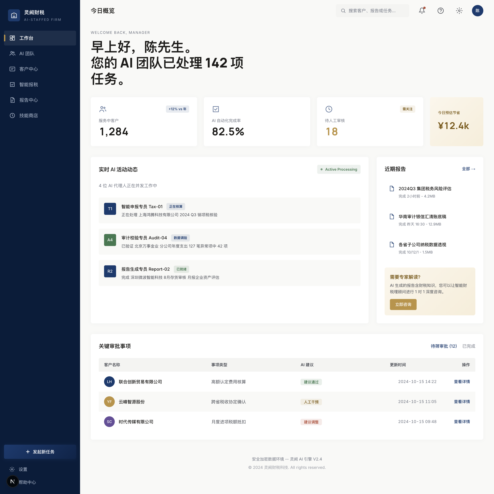
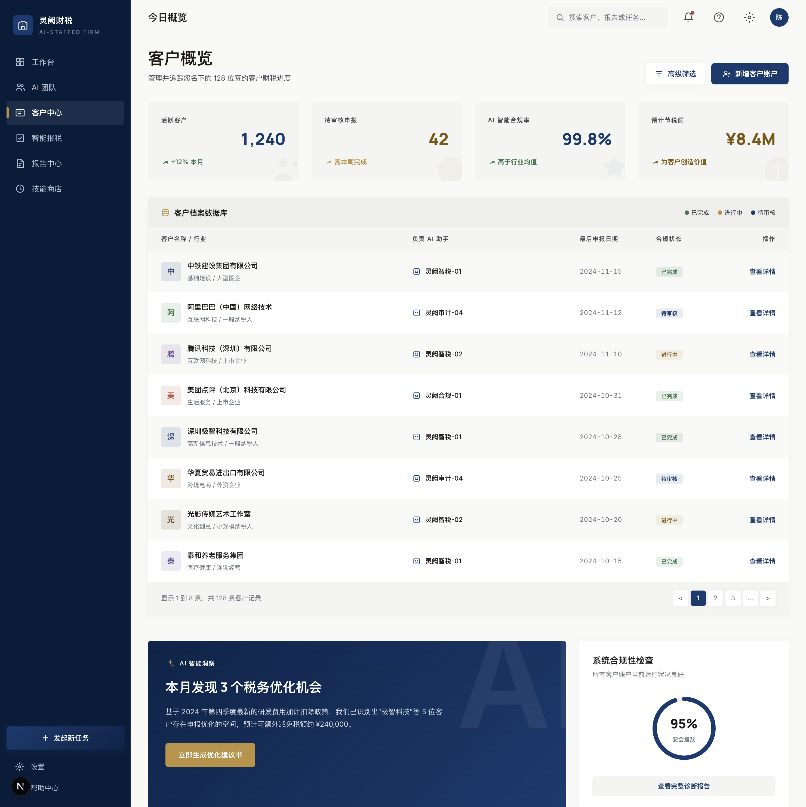
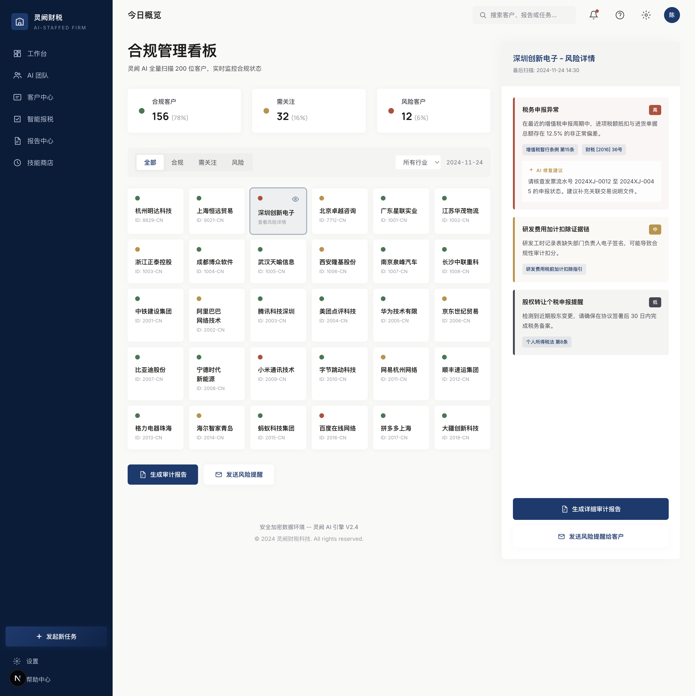
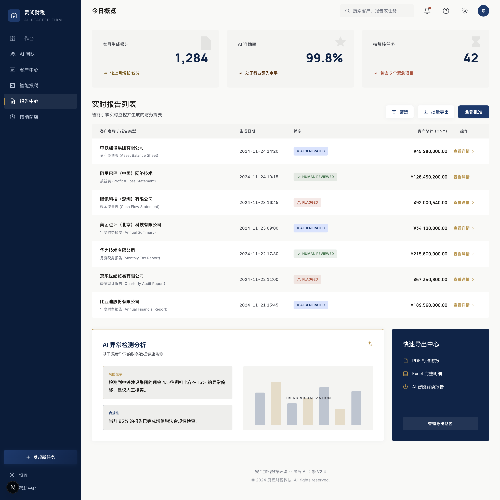

<div align="center">

# CogNebula Enterprise

**The Out-of-the-Box Enterprise Context Brain for AI Agents**

[](https://python.org)
[](#license)
[](#one-click-deployment)
[](https://kuzudb.com)

</div>

CogNebula is a SOTA codebase and domain knowledge graph platform that provides structural and semantic context (Graph RAG) to AI Agents — LangChain, CrewAI, Claude Desktop, Cursor, and any MCP-compatible client.

Completely self-contained. Air-gapped ready. Built for enterprise commercialization.

<p align="center">
  
</p>

## Architecture

```
┌──────────────────────────────────────────────────────────┐
│                    CogNebula Enterprise                   │
├──────────────────────────────────────────────────────────┤
│                                                          │
│   ┌──────────┐    ┌──────────┐    ┌──────────────────┐   │
│   │  WebGL   │    │  REST    │    │  MCP Server      │   │
│   │  3D UI   │    │  API     │    │  (stdio/SSE)     │   │
│   └────┬─────┘    └────┬─────┘    └────────┬─────────┘   │
│        │               │                   │             │
│        └───────────┬───┴───────────────────┘             │
│                    │                                     │
│          ┌────────┴────────┐                             │
│          │   Graph RAG     │  Hybrid retrieval:          │
│          │   Engine        │  Vector + Graph Topology    │
│          └────────┬────────┘                             │
│                   │                                      │
│     ┌─────────────┼─────────────┐                        │
│     │             │             │                        │
│  ┌──┴──┐    ┌─────┴─────┐   ┌──┴───┐                    │
│  │Kuzu │    │  LanceDB  │   │Redis │  Event-driven      │
│  │ DB  │    │  Vectors  │   │Queue │  sync worker        │
│  └─────┘    └───────────┘   └──────┘                    │
│                                                          │
│  Per-tenant isolated DB dirs (shared-nothing)            │
└──────────────────────────────────────────────────────────┘
```

## Key Features

| Feature | Description |
|---------|-------------|
| **Pure Local & Air-gapped** | KuzuDB (MIT) + LanceDB (Apache). Zero external dependencies. Enterprise code stays secure |
| **Hybrid Graph RAG** | Vector embeddings (semantic search) + graph topology (structural blast-radius analysis) for precision context |
| **Adaptive Context Windowing** | Tiered detail degradation — Depth 0 returns full code, Depth 1 returns signatures. Prevents LLM token explosion |
| **Shared-Nothing Tenancy** | Each repo/tenant gets a dedicated DB directory. Zero cross-tenant data leakage |
| **Event-Driven Sync** | Webhook-driven Redis queue keeps AI context fresh via continuous indexing |
| **WebGL 3D Console** | Interactive knowledge graph visualization for exploration and debugging |

## One-Click Deployment

### 1. Mount the real KG data
```bash
# On the production host:
export COGNEBULA_GRAPH_PATH=/home/kg/cognebula-enterprise/data/finance-tax-graph
export COGNEBULA_LANCE_PATH=/home/kg/data/lancedb
export KG_API_KEY=your-key
```

### 2. Start the cluster
```bash
docker compose up -d --build
```

### 3. Access
- **Static Web App**: http://localhost:3001/
- **Protected KG API**: http://localhost:8400/
- **Swagger/OpenAPI Docs**: http://localhost:8400/docs

The Docker Compose package now runs the API and a static web container separately.
The web container proxies `/api/v1/*` to `cognebula-api` and injects `KG_API_KEY`
server-side, so the browser never needs the secret.

The packaged stack has no demo database default. `COGNEBULA_GRAPH_PATH` and
`COGNEBULA_LANCE_PATH` are required, and `kg-api-server.py` refuses known demo,
archived, or empty KG paths before opening Kuzu. For local development, prefer
the real Tailscale API instead of mirroring the 102 GB production graph:

```bash
COGNEBULA_KG_URL=http://100.88.170.57:8400 ./.venv/bin/python scripts/_lib/prod_kg_client.py
```

The packaged web container defaults to `3001` to avoid the very common `3000`
collision with other local dev stacks. If you need a different port, override it:

```bash
COGNEBULA_WEB_PORT=3001 KG_API_KEY=your-key docker compose up -d --build
```

## Agent Integration (Packaged API)

The packaged local stack exposes the protected KG API on `http://localhost:8400`
and the browser-safe proxy on `http://localhost:3001/api/v1/*`.

Search example:

```bash
curl -H "X-API-Key: your-key" \
  "http://localhost:8400/api/v1/search?q=%E5%A2%9E%E5%80%BC%E7%A8%8E&limit=5"
```

Hybrid search example:

```bash
curl -H "X-API-Key: your-key" \
  "http://localhost:8400/api/v1/hybrid-search?q=%E5%A2%9E%E5%80%BC%E7%A8%8E&limit=5&expand=true"
```

If you are using the packaged web container locally, the same endpoints are
available without passing the secret in the browser path:

```bash
curl "http://localhost:3001/api/v1/search?q=%E5%A2%9E%E5%80%BC%E7%A8%8E&limit=5"
```

## Screenshots

<table>
  <tr>
    <td></td>
    <td></td>
  </tr>
  <tr>
    <td></td>
    <td></td>
  </tr>
</table>

## Tech Stack

- **Graph DB**: KuzuDB (MIT) — property graph with Cypher queries
- **Vector DB**: LanceDB (Apache/MIT) — columnar vector search
- **API**: FastAPI + Pydantic v2
- **Queue**: Redis — event-driven ingestion worker
- **Frontend**: WebGL 3D knowledge graph console
- **Deploy**: Docker Compose (API Gateway + Ingestion Worker + Redis)

## License

Commercial. Built on MIT/Apache open-source foundations (KuzuDB, LanceDB, FastAPI). Designed for integration into proprietary B2B SaaS and private cloud environments.

---

<p align="center"><sub>Maurice | maurice_wen@proton.me</sub></p>
