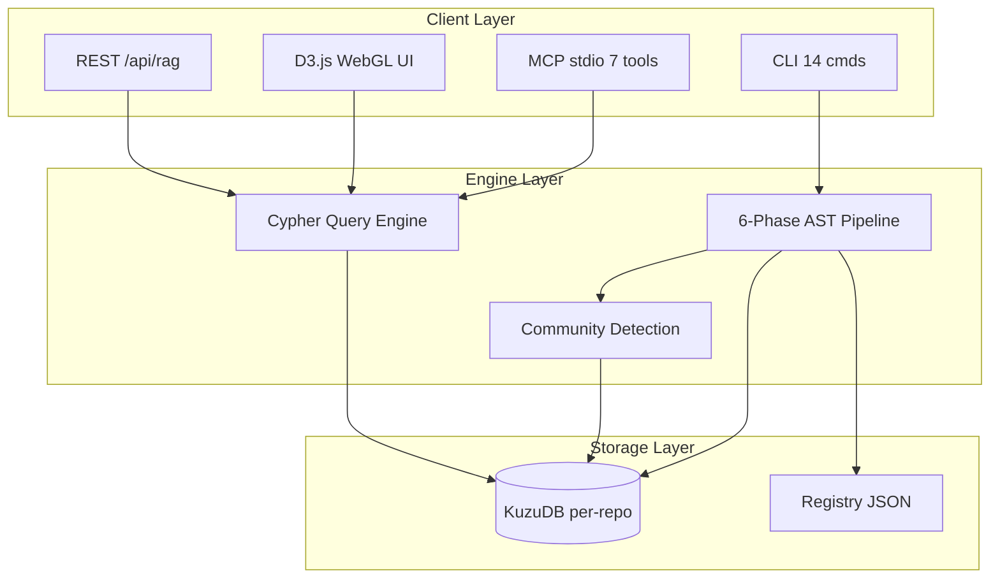
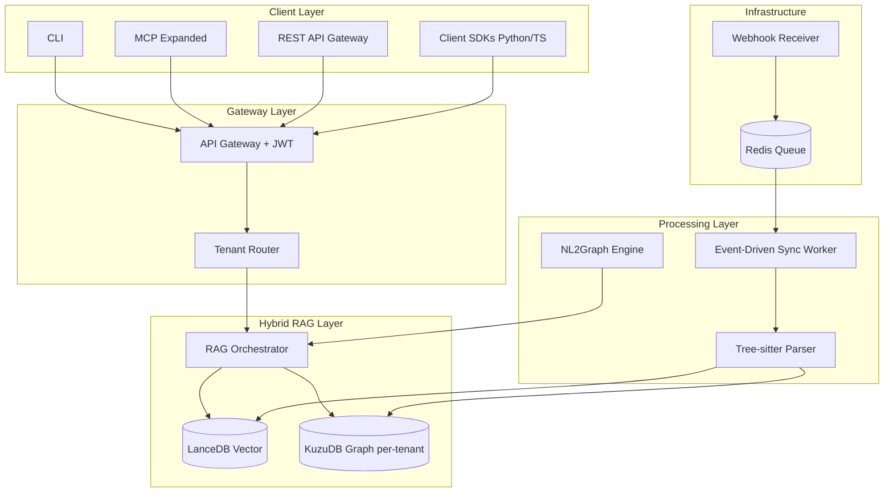

# CogNebula Enterprise -- System Architecture

> Version: 0.1 (Draft) | Last updated: 2026-03-03

<!-- AI-TOOLS:PROJECT_DIR:BEGIN -->
PROJECT_DIR: /Users/mauricewen/Projects/cognebula-enterprise
<!-- AI-TOOLS:PROJECT_DIR:END -->

## Current Architecture (v1.0)

### Pipeline Phases
1. **Extract** -- discover source files (`.py`, `.ts`, `.tsx`, `.js`, `.jsx`)
2. **Structure** -- build folder/file hierarchy nodes
3. **Parse** -- AST (Python) / regex (JS/TS) symbol extraction
4. **Imports** -- resolve import/require edges
5. **Calls** -- resolve function/method call edges
6. **Heritage** -- resolve class inheritance/implementation edges
7. **Community** -- simplified Leiden community detection

### Storage Model
- Per-repo KuzuDB at `<repo>/.cognebula/graph/`
- Node tables: Module, File, Folder, Function, Class, Interface, Method, ArrowFunction, External, Community
- Edge types: CONTAINS, DEFINES, IMPORTS, CALLS, EXTENDS, IMPLEMENTS, MEMBER_OF (+ variants)

## Target Architecture (v2.0 -- SOTA)

### Key Architecture Decisions
1. **Shared-Nothing**: One KuzuDB directory per repo/tenant (hardware isolation)
2. **Late-Binding Hybrid RAG**: LanceDB finds semantic entry point -> KuzuDB maps blast radius
3. **Tree-sitter**: Universal parser with error recovery (replaces regex for JS/TS)
4. **Event-Driven**: Webhook -> Redis -> Single-threaded ingester per repo
5. **API Gateway**: JWT validation + tenant routing before any DB access

## System Boundaries
(to be refined after SOTA research -- competitive feature matrix will inform boundary decisions)

---

Maurice | maurice_wen@proton.me
