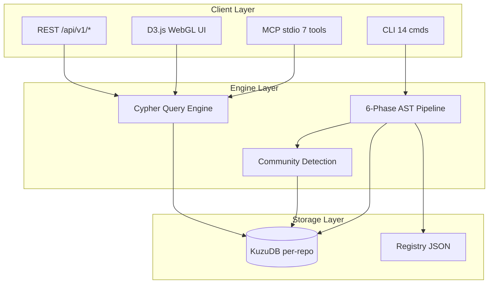
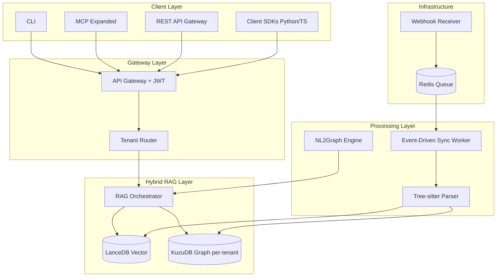

# CogNebula Enterprise -- System Architecture

> Version: 0.3 (Updated) | Last updated: 2026-04-23
>
> **2026-04-27 audit pointer**: SOP 3.2 front-back consistency audit found a P0 dual-backend drift (`kg-api-server.py` vs `src/api/kg_api.py` both targeting port 8400 with mostly disjoint route sets). Findings logged at `outputs/reports/consistency-audit/2026-04-27-sop-3.2-audit.md`. Fix is HITL-pending (3 options: merge / formalize-split / deprecate-one). Do not rely on this doc's backend description until that audit is closed.
>
> **2026-04-28 update**: Sprint G1 turned the hand audit into a reproducible probe — `scripts/audit_api_contract.py` parses both backends + all frontend HTML, emits JSON drift report, and `tests/test_api_contract_drift.py` (4 tests) is wired into the nightly tier (5,860 → 5,864). Probe corrected the original "ZERO route overlap" claim to **3 overlap** (`/`, `/api/v1/ingest`, `/api/v1/quality`); P0 dual-backend signal still holds (`dual_backend_drift_ratio = 0.12`, well below 0.25 threshold). Frontend orphan set locked at `{/api/v1/ka/}` — any new orphan triggers a nightly fail.

<!-- AI-TOOLS:PROJECT_DIR:BEGIN -->
PROJECT_DIR: /Users/mauricewen/Projects/27-cognebula-enterprise
<!-- AI-TOOLS:PROJECT_DIR:END -->

## Historical Prototype Architecture (v1.0)



### Pipeline Phases
1. **Extract** -- discover source files (`.py`, `.ts`, `.tsx`, `.js`, `.jsx`)
2. **Structure** -- build folder/file hierarchy nodes
3. **Parse** -- AST (Python) / regex (JS/TS) symbol extraction
4. **Imports** -- resolve import/require edges
5. **Calls** -- resolve function/method call edges
6. **Heritage** -- resolve class inheritance/implementation edges
7. **Community** -- simplified Leiden community detection

### Storage Model
- Per-repo KuzuDB at `<repo>/.cognebula/graph/`
- Node tables: Module, File, Folder, Function, Class, Interface, Method, ArrowFunction, External, Community
- Edge types: CONTAINS, DEFINES, IMPORTS, CALLS, EXTENDS, IMPLEMENTS, MEMBER_OF (+ variants)

## Target Architecture (v2.0 -- SOTA)



### Key Architecture Decisions
1. **Shared-Nothing**: One KuzuDB directory per repo/tenant (hardware isolation)
2. **Late-Binding Hybrid RAG**: LanceDB finds semantic entry point -> KuzuDB maps blast radius
3. **Tree-sitter**: Universal parser with error recovery (replaces regex for JS/TS)
4. **Event-Driven**: Webhook -> Redis -> Single-threaded ingester per repo
5. **API Gateway**: JWT validation + tenant routing before any DB access

## Actual Current Architecture (2026-04-10)

The v1.0 diagram above describes the original code intelligence prototype. The actual production system is a **finance/tax domain knowledge graph**:

```
Local self-hosted package (`docker compose`, explicit real mounts only)
  ├── Static web app: http://localhost:3001/
  ├── Browser-safe local proxy: http://localhost:3001/api/v1/*
  └── Protected KG API: http://localhost:8400/api/v1/*
      └── Requires COGNEBULA_GRAPH_PATH + COGNEBULA_LANCE_PATH; no demo default

Static frontend (`web/`, Next.js `output: export`)
  ├── Browser uses HTTPS only
  ├── KG client targets `https://cognebula-kg-proxy.workers.dev/api/v1`
  ├── Local dev target defaults to real Tailscale API: `http://100.88.170.57:8400/api/v1`
  ├── `/expert/data-quality` consumes `/stats` + `/quality` + `/ontology-audit`
  └── No browser-side storage of `KG_API_KEY`

Cloudflare Worker proxy (`worker/src/index.ts`)
  ├── Bridges static web HTTPS requests to the protected KG API
  ├── Injects `X-API-Key` from Worker secret / env binding
  └── Preserves static export deployment model while keeping auth server-side

kg-api-server.py (108K lines, FastAPI, port 8400)
  ├── Production DB path: /home/kg/cognebula-enterprise/data/finance-tax-graph
  ├── Production LanceDB path: /home/kg/data/lancedb
  ├── Live verified state (2026-04-28): 368,910 nodes / 1,014,862 edges / 118,011 LanceDB rows
  ├── Runtime guard: refuses demo, archived, missing, or empty DB paths before opening Kuzu
  ├── Endpoints: /stats, /quality, /ontology-audit, /search, /hybrid-search, /nodes, /neighbors, /admin/*
  ├── Auth: `KG_API_KEY` middleware on non-exempt API routes
  ├── Hygiene Gate: `/quality` (title/content coverage + edge density inside curated tables)
  ├── Structural Gate: `/ontology-audit` (canonical conformance, rogue types, over-ceiling drift)
  └── Embedding: LanceDB 869,882 vectors (~100% coverage)

M3 Orchestrator (cron 02:00 UTC daily)
  ├── Step 1: QA Generation (Gemini 2.5 Flash, 2K QA pairs/run)
  ├── Step 2: KU Content Backfill (batch-size=15)
  ├── Step 2b: FAQ Content Fill
  ├── Step 2c: Content Cleanup Pipeline
  ├── Step 3: Edge Engine (AI-generated relationships)
  ├── Step 4: Batch Edge Enrichment (keyword-based)
  ├── Step 5-6: API restart + quality check
  ├── Step 7-8: Daily + deep crawl (chinatax, cctaa, cicpa, etc.)
  └── Step 9: Incremental embedding rebuild

Daily Pipeline (cron 10:00 UTC)
  └── Crawl + ingest from tax authority websites

Data sources: chinatax.gov.cn, cctaa.cn, cicpa.org.cn, law datasets, CPA knowledge
```

## System Boundaries (refined post-SOTA)

| Boundary | Inside | Outside |
|----------|--------|---------|
| Knowledge domain | Chinese finance/tax regulation | Other jurisdictions, code intelligence |
| Data ingestion | Crawl + parse + enrich (Gemini) | Real-time user transaction data |
| Agent interface | REST API + MCP Server + HTTPS browser proxy | IDE plugins and unrelated third-party frontends |
| Graph engine | KuzuDB (or Vela fork/FalkorDB) | Neo4j Aura (over-engineered for 620K nodes) |
| Hosting | Single VPS (8GB, self-managed) | Cloud-native / Kubernetes (future) |

## Frontend Surface Topology (cross-project contract, 2026-04-28)

> **Symmetric write** — canonical authoring lives in `30-lingque-agent/doc/00_project/initiative_lingque_agent/SYSTEM_ARCHITECTURE.md` §1.3 Four-Frontend Topology. This section pins CogNebula Enterprise's role in that topology so the two repos do not drift.

CogNebula Enterprise (System A) ships **one frontend** in this topology:

| # | Frontend | Domain | Audience | Status (2026-04-28) | Routing enforcement |
|---|---|---|---|---|---|
| 1 | **CogNebula KG Console** (System A internal infrastructure) | `hegui.io` (root) | Internal infra engineers + KG ops | **LIVE** — 518,498 nodes / 1,293,535 edges, 100% quality score visible at `hegui.io/` | CF Pages, internal IP allowlist + Cloudflare Access (advisory until SSO middleware ships in Stage 38 of the lingque side) |

The other three surfaces (`hegui.app` Lingque Agent Platform, `yiclaw.hegui.io` business frontend, `wiki.hegui.cn` public docs) are owned by `30-lingque-agent`, `25-yiclaw`, and the wiki repo respectively. CogNebula does **not** own DNS for those domains; it only honors the cross-domain contract for inbound calls from agents (via CF Worker proxy, not human navigation).

**KG invisibility principle**: customer-tier surfaces (`yiclaw.hegui.io`, `hegui.app` non-operator users) MUST NEVER expose a human-clickable link to `hegui.io`. The KG is consumed by agents through the MCP server / CF Worker proxy, not navigated by humans. Audit obligation lives on each customer-facing repo; CogNebula's obligation is to refuse non-agent UA via Cloudflare Access (advisory until enforcement middleware ships).

**Migration backlog impact on this repo**: M5 (audit `hegui.io` for inbound links from customer surfaces) is the only item in the lingque-side M1-M5 backlog that touches CogNebula directly — when M5 fires, this repo's CF Pages config gets a referer-allowlist sweep. Other items (M1 yiclaw subdomain split, M2 SSO middleware, M3 `?return_to=` parsing, M4 header links) are owned outside this repo.

**Why this section exists**: a 2026-04-28 audit identified that decisions written to `30-lingque-agent/SYSTEM_ARCHITECTURE.md` could silently drift from `27-cognebula-enterprise/SYSTEM_ARCHITECTURE.md` because both repos describe overlapping surfaces. This symmetric-write paragraph is the failure-mode mitigation; canonical edits still happen on the lingque side.

## Key Risks (from SOTA Research)

1. **KuzuDB archived** (Oct 2025): Evaluate Vela Partners fork stability or migrate to FalkorDB (Cypher-compatible)
2. **No MCP Server**: All major platforms (Neo4j, Augment, Copilot, CrewAI) have MCP. Window closing
3. **Benchmark maintenance**: published hybrid benchmark exists (79% overall / 100 pass), but it must stay green after each retrieval or schema change

---

Maurice | maurice_wen@proton.me
