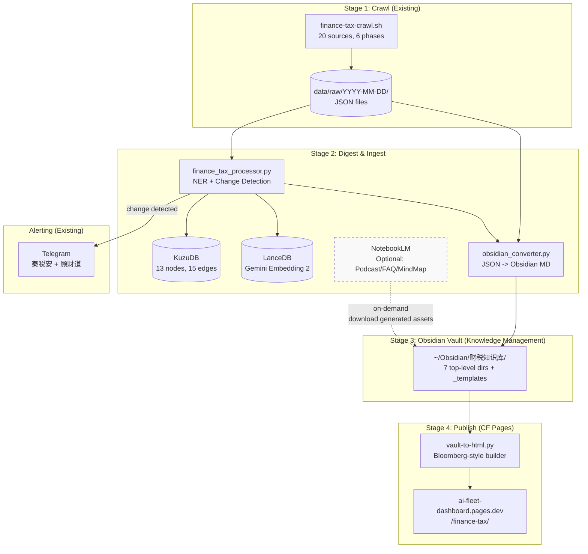
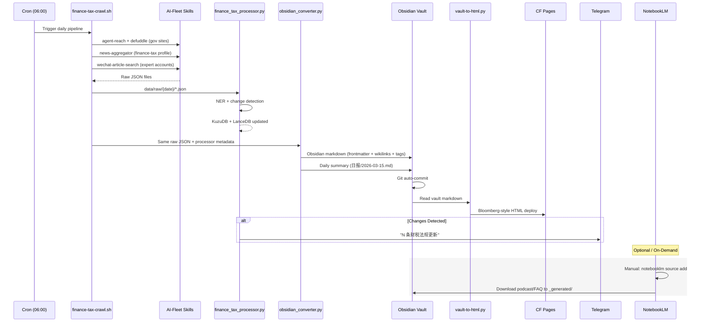

# Finance/Tax Knowledge Accumulation Pipeline (财税知识沉淀管线)

> v1.0 | 2026-03-15 | Initiative: finance_tax_kb
> Architecture: Obsidian-Centric with NotebookLM as optional enrichment layer

<!-- AI-TOOLS:PROJECT_DIR:BEGIN -->
PROJECT_DIR: /Users/mauricewen/Projects/cognebula-enterprise
<!-- AI-TOOLS:PROJECT_DIR:END -->

## 1. Decision Log

### ADR-001: Pipeline Topology -- Obsidian-Centric vs NotebookLM-Centric

**Context**: Need a 4-stage pipeline: Crawl -> Digest -> Manage -> Publish. Two AI-powered systems available: Google NotebookLM (`anything-to-notebooklm` skill) and local Obsidian vault.

**Options Evaluated**:

| # | Option | Core Sink | NotebookLM Role | Risk | Complexity |
|---|--------|-----------|-----------------|------|------------|
| A | NotebookLM-Centric | NotebookLM | Primary digest + generate | High (auth expiry, rate limits, Google API churn) | Medium |
| B | **Obsidian-Centric** | Obsidian vault | Optional enrichment | Low (fully local) | Medium |
| C | Dual-Track Parallel | Both simultaneously | Co-primary | Medium (sync conflicts) | High |

**Decision**: **Option B -- Obsidian-Centric**

**Rationale**:
1. `notebooklm login` requires browser-based OAuth; cannot run unattended in cron
2. NotebookLM has undocumented rate limits; 50+ files/day batch upload is untested
3. Obsidian vault = Git repo = natural versioning, diffing, and CI/CD integration
4. NotebookLM remains accessible on-demand (manual or triggered) for podcast/FAQ generation
5. Single source of truth principle: vault is the authoritative store; NotebookLM is a derived view

**Consequences**:
- Need ~200 lines Python for JSON-to-Obsidian-Markdown converter
- NotebookLM sync is a manual/on-demand step, not in the daily cron critical path
- Obsidian vault must be Git-tracked for CF Pages build pipeline

---

## 2. Pipeline Architecture Overview



### Data Flow Summary

```
06:00  finance-tax-crawl.sh        -> data/raw/2026-03-15/*.json
06:15  finance_tax_processor.py     -> KuzuDB + LanceDB (graph + vectors)
06:20  obsidian_converter.py        -> ~/Obsidian/财税知识库/ (markdown files)
06:25  vault-to-html.py             -> build/ (static HTML)
06:30  sync-docs-and-deploy.sh      -> CF Pages deploy
06:35  Telegram alert               -> 秦税安 + 顾财道 (if changes detected)
```

---

## 3. Stage-by-Stage Design

### Stage 1: Crawl (Already Built)

**Script**: `scripts/finance-tax-crawl.sh`
**Output**: `data/raw/{date}/*.json`
**Skills used**: agent-reach, browser-automation, defuddle, multi-search-engine, news-aggregator, wechat-article-search, scrapling-crawler
**Sources**: 20 domestic (4 P0 gov + 8 P1 professional + 8 P2 media/community)

No changes needed. Existing pipeline is production-ready.

### Stage 2: Digest & Ingest (Dual Output)

Stage 2 splits into two parallel tracks from the same raw JSON input:

#### Track A: Graph + Vector (Existing)

Already designed in SYSTEM_ARCHITECTURE.md:
- `finance_tax_processor.py`: Rule-based NER, 3-tier change detection
- KuzuDB: 13-node China tax ontology (18 tax types, 42 CAS)
- LanceDB: Gemini Embedding 2 vectors via `bin/embed`

#### Track B: Obsidian Conversion (New)

**New script**: `scripts/obsidian_converter.py` (~200 lines)

Input: `data/raw/{date}/*.json` + processor metadata (NER results, change status)
Output: Obsidian-flavored markdown files in vault

```python
# obsidian_converter.py -- Convert crawled JSON to Obsidian markdown
#
# For each raw JSON document:
# 1. Generate YAML frontmatter (source, date, tax_type, regulation_number, status, tags)
# 2. Convert body to markdown with wikilinks ([[增值税]], [[CAS 14]])
# 3. Add callouts for key regulatory changes (> [!warning] or > [!info])
# 4. Route to correct vault subdirectory based on content type
# 5. Create/update daily summary in 日报/ directory

VAULT_DIR = os.path.expanduser("~/Obsidian/财税知识库")

# Content type -> vault subdirectory routing
ROUTING = {
    "regulation":     "法规",        # L1: by issuing authority
    "guide":          "操作指南",     # L2: journal entries, filing guides
    "compliance":     "合规检查",     # L3: compliance rules, risk alerts
    "daily_summary":  "日报",        # Daily crawl summaries
    "by_tax_type":    "税种",        # By tax type (18 folders)
    "by_industry":    "行业",        # By industry
}

# Wikilink generation: detect known entities and wrap in [[]]
WIKILINK_ENTITIES = {
    "增值税", "企业所得税", "个人所得税", "消费税", "关税",
    "城市维护建设税", "房产税", "土地增值税", "契税", "印花税",
    "资源税", "环境保护税", "车辆购置税", "车船税", "耕地占用税",
    "烟叶税", "船舶吨税", "城镇土地使用税",
    # CAS standards
    *[f"CAS {i}" for i in range(1, 43)],
    # Common terms
    "一般纳税人", "小规模纳税人", "居民企业", "非居民企业",
    "自贸区", "高新技术企业", "小微企业",
}
```

**Frontmatter schema** (per document):

```yaml
---
source: "chinatax.gov.cn"
source_url: "https://fgk.chinatax.gov.cn/..."
crawl_date: "2026-03-15"
publish_date: "2026-03-14"
title: "关于调整增值税税率的公告"
regulation_number: "财税[2026]15号"
issuing_authority: "财政部 国家税务总局"
tax_type:
  - "增值税"
content_type: "regulation"  # regulation|guide|compliance|news|analysis
status: "active"            # active|expired|superseded|proposed
change_type: "new"          # new|updated|unchanged
tags:
  - "#法规"
  - "#增值税"
  - "#2026"
aliases:
  - "财税2026第15号"
---
```

#### Track C: NotebookLM (Optional, On-Demand)

**Not in daily cron**. Invoked manually or via Claude Code skill trigger.

```bash
# Manual: upload this week's regulations to NotebookLM
notebooklm create "财税知识库 -- 2026-W11"
for f in ~/Obsidian/财税知识库/法规/2026-03-1*.md; do
    notebooklm source add "$f" --wait
    sleep 3  # rate limit protection
done

# Generate podcast summary of the week
notebooklm generate audio --instructions "用中文总结本周重要财税政策变化，轻松专业风格，5分钟"

# Generate FAQ
notebooklm generate report --instructions "生成本周财税政策FAQ，问答格式，面向中小企业"
```

**Integration with vault**: Generated assets (podcast MP3, FAQ markdown, mind map JSON) are saved to:
```
~/Obsidian/财税知识库/
  _generated/
    podcasts/2026-W11-summary.mp3
    faqs/2026-W11-faq.md
    mindmaps/2026-W11-tax-changes.json
```

### Stage 3: Obsidian Vault Structure

```
~/Obsidian/财税知识库/
├── 法规/                          # L1: Regulations by source
│   ├── 国家税务总局/               # SAT announcements
│   ├── 财政部/                    # MOF policies
│   ├── 国务院/                    # State Council directives
│   ├── 海关总署/                  # Customs tariff updates
│   ├── 央行/                     # PBC regulations
│   └── 注册会计师协会/             # CICPA standards
├── 操作指南/                      # L2: Operational guides
│   ├── 会计分录/                  # Journal entry templates
│   ├── 纳税申报/                  # Filing procedures
│   ├── 发票管理/                  # Invoice management
│   └── 税务登记/                  # Registration guides
├── 合规检查/                      # L3: Compliance rules
│   ├── 风险预警/                  # Risk alerts
│   ├── 自查清单/                  # Self-check checklists
│   └── 处罚案例/                  # Penalty case studies
├── 日报/                          # Daily crawl summaries
│   ├── 2026-03-15.md             # One file per day
│   ├── 2026-03-14.md
│   └── ...
├── 税种/                          # By tax type (18 folders)
│   ├── 增值税/
│   ├── 企业所得税/
│   ├── 个人所得税/
│   ├── 消费税/
│   ├── 关税/
│   ├── 城市维护建设税/
│   ├── 房产税/
│   ├── 土地增值税/
│   ├── 契税/
│   ├── 印花税/
│   ├── 资源税/
│   ├── 环境保护税/
│   ├── 车辆购置税/
│   ├── 车船税/
│   ├── 耕地占用税/
│   ├── 烟叶税/
│   ├── 船舶吨税/
│   └── 城镇土地使用税/
├── 行业/                          # By industry
│   ├── 软件和信息技术/
│   ├── 制造业/
│   ├── 房地产/
│   ├── 金融/
│   └── ...
├── _generated/                    # NotebookLM outputs (optional)
│   ├── podcasts/
│   ├── faqs/
│   └── mindmaps/
├── _templates/                    # Obsidian templates
│   ├── 法规模板.md
│   ├── 操作指南模板.md
│   ├── 日报模板.md
│   └── 合规检查模板.md
└── _index/                        # Auto-generated indexes
    ├── 按税种索引.md
    ├── 按时间索引.md
    └── 按来源索引.md
```

**Obsidian features leveraged**:

| Feature | Usage |
|---------|-------|
| YAML frontmatter | Structured metadata for filtering + Dataview queries |
| Wikilinks `[[]]` | Cross-reference tax types, standards, regulations |
| Tags `#` | `#法规` `#增值税` `#2026` for faceted search |
| Callouts `> [!type]` | `[!warning]` for breaking changes, `[!info]` for new policies |
| Dataview plugin | Dynamic queries: "all active VAT regulations sorted by date" |
| Templates | Consistent format for each content type |
| Canvas | Visual relationship maps (via obsidian-visual-skills) |

**Template example** (`_templates/法规模板.md`):

```markdown
---
source: "{{source}}"
source_url: "{{url}}"
crawl_date: "{{date}}"
publish_date: ""
title: "{{title}}"
regulation_number: ""
issuing_authority: ""
tax_type: []
content_type: "regulation"
status: "active"
change_type: "new"
tags: []
---

# {{title}}

> [!info] 来源
> {{source}} | {{date}}

## 要点

## 正文

## 相关法规

## 影响分析
```

### Stage 4: CF Pages Publishing

**Route**: `ai-fleet-dashboard.pages.dev/finance-tax/`

**Build script**: `scripts/vault-to-html.py`

```python
# vault-to-html.py -- Convert Obsidian vault to Bloomberg-style HTML pages
#
# 1. Walk vault directory, parse frontmatter + markdown body
# 2. Apply Bloomberg Terminal design system (html-bloomberg-style skill)
# 3. Generate index pages (by date, by tax type, by source)
# 4. Generate daily digest page (latest 日报/ entry)
# 5. Output to build/ directory for CF Pages deployment

# Page types:
# /finance-tax/                     -> Dashboard overview (Bloomberg-style)
# /finance-tax/daily/2026-03-15     -> Daily summary
# /finance-tax/regulation/{slug}    -> Individual regulation page
# /finance-tax/tax/{tax-type}       -> Tax type overview + related regulations
# /finance-tax/industry/{industry}  -> Industry compliance view
# /finance-tax/podcast/             -> NotebookLM podcast archive (if generated)
```

**Bloomberg-style dashboard features**:
- Data-dense layout with monospace fonts for regulation numbers
- Color-coded status indicators: green (active), amber (proposed), red (expiring)
- Time-series view: regulations published per day/week/month
- Breaking changes highlighted at top (banner)
- Source authority badges (P0/P1/P2)
- Mobile-responsive but desktop-optimized

**CF Pages integration**:

Extends existing dashboard-sync mechanism (`configs/com.ai-fleet.dashboard-sync.plist`):

```xml
<!-- Add to WatchPaths -->
<string>/Users/mauricewen/Obsidian/财税知识库</string>
```

On vault change -> LaunchAgent triggers `sync-docs-and-deploy.sh` -> rebuilds finance-tax section -> deploys to CF Pages.

---

## 4. Pipeline Orchestration

### Daily Cron Schedule

```bash
# In VPS crontab (or Mac launchd)
# Full pipeline: crawl -> process -> obsidian -> build -> deploy
0 6 * * * cd /Users/mauricewen/Projects/cognebula-enterprise && bash scripts/finance-tax-knowledge-pipeline.sh 2>&1 | tee -a data/logs/pipeline-$(date +\%Y-\%m-\%d).log
```

### Master Pipeline Script

**File**: `scripts/finance-tax-knowledge-pipeline.sh`

```bash
#!/usr/bin/env bash
# finance-tax-knowledge-pipeline.sh -- Full 4-stage knowledge accumulation pipeline
# Registered in pipeline-registry.json as "finance-tax-knowledge"
#
# Stages:
#   1. Crawl       (finance-tax-crawl.sh)           -> data/raw/{date}/
#   2. Process     (finance_tax_processor.py)        -> KuzuDB + LanceDB
#   3. Obsidian    (obsidian_converter.py)           -> ~/Obsidian/财税知识库/
#   4. Publish     (vault-to-html.py + CF deploy)    -> CF Pages

set -euo pipefail

SCRIPT_DIR="$(cd "$(dirname "$0")" && pwd)"
PROJECT_DIR="$(cd "$SCRIPT_DIR/.." && pwd)"
AI_FLEET_DIR="${AI_FLEET_DIR:-$HOME/00-AI-Fleet}"
VAULT_DIR="${VAULT_DIR:-$HOME/Obsidian/财税知识库}"
DATE_TAG=$(date +%Y-%m-%d)
DATA_DIR="$PROJECT_DIR/data/raw/$DATE_TAG"
BUILD_DIR="$PROJECT_DIR/build/finance-tax"
LOG_DIR="$PROJECT_DIR/data/logs"

mkdir -p "$DATA_DIR" "$BUILD_DIR" "$LOG_DIR" "$VAULT_DIR"

log() { echo "$(date +%H:%M:%S) NOTE: $*"; }
err() { echo "$(date +%H:%M:%S) ERROR: $*" >&2; }
warn() { echo "$(date +%H:%M:%S) WARN: $*"; }

# ── Stage 1: Crawl ──────────────────────────────────────────────────────
stage_crawl() {
    log "=== Stage 1: Crawl (20 sources) ==="
    bash "$SCRIPT_DIR/finance-tax-crawl.sh" --all
    local count
    count=$(find "$DATA_DIR" -name "*.json" 2>/dev/null | wc -l | tr -d ' ')
    log "Crawl complete: $count JSON files in $DATA_DIR"
}

# ── Stage 2: Process (Graph + Vectors) ──────────────────────────────────
stage_process() {
    log "=== Stage 2: Process (NER + KuzuDB + LanceDB) ==="
    python3 "$PROJECT_DIR/src/finance_tax_processor.py" \
        --input "$DATA_DIR" \
        --db "$PROJECT_DIR/data/finance-tax-graph" \
        --stats-output "$PROJECT_DIR/data/stats/$DATE_TAG.json"
    log "Processing complete"
}

# ── Stage 3: Obsidian Conversion ────────────────────────────────────────
stage_obsidian() {
    log "=== Stage 3: Obsidian Vault Sync ==="
    python3 "$SCRIPT_DIR/obsidian_converter.py" \
        --input "$DATA_DIR" \
        --metadata "$PROJECT_DIR/data/stats/$DATE_TAG.json" \
        --vault "$VAULT_DIR" \
        --date "$DATE_TAG"

    # Count files created/updated
    local new_count
    new_count=$(find "$VAULT_DIR" -name "*.md" -newer "$DATA_DIR" 2>/dev/null | wc -l | tr -d ' ')
    log "Obsidian sync complete: $new_count files created/updated in vault"

    # Git commit vault changes (if vault is a git repo)
    if [[ -d "$VAULT_DIR/.git" ]]; then
        cd "$VAULT_DIR"
        git add -A
        git diff --cached --quiet || git commit -m "auto: daily sync $DATE_TAG ($new_count files)"
        cd "$PROJECT_DIR"
        log "Vault committed to Git"
    fi
}

# ── Stage 4: Publish to CF Pages ────────────────────────────────────────
stage_publish() {
    log "=== Stage 4: Publish to CF Pages ==="
    python3 "$SCRIPT_DIR/vault-to-html.py" \
        --vault "$VAULT_DIR" \
        --output "$BUILD_DIR" \
        --style bloomberg \
        --date "$DATE_TAG"

    # Trigger dashboard sync (if LaunchAgent is active, WatchPath will fire)
    # Otherwise, manual deploy:
    if command -v wrangler &>/dev/null; then
        log "Deploying to CF Pages..."
        # wrangler pages deploy "$BUILD_DIR" --project-name ai-fleet-dashboard
    else
        log "wrangler not found, skipping CF Pages deploy (LaunchAgent will handle)"
    fi
    log "Publish complete"
}

# ── Stage 5: Alert ──────────────────────────────────────────────────────
stage_alert() {
    log "=== Stage 5: Alerts ==="
    local stats="$PROJECT_DIR/data/stats/$DATE_TAG.json"
    if [[ -f "$stats" ]]; then
        local changed
        changed=$(python3 -c "import json; d=json.load(open('$stats')); print(d.get('changed', 0))" 2>/dev/null || echo 0)
        if [[ "$changed" -gt 0 ]]; then
            log "$changed new/updated documents detected -- sending alerts"
            # Telegram via existing digest pipeline
            # "$AI_FLEET_DIR/scripts/fleet-telegram-bot.mjs" send \
            #     --chat finance-tax \
            #     --message "NOTE: $changed 条财税法规更新 ($DATE_TAG)"
        else
            log "No changes detected today"
        fi
    fi
}

# ── Main ────────────────────────────────────────────────────────────────
main() {
    log "==== Finance/Tax Knowledge Pipeline ===="
    log "Date: $DATE_TAG"
    log "Project: $PROJECT_DIR"
    log "Vault: $VAULT_DIR"

    local phase="${1:---all}"
    case "$phase" in
        --all)
            stage_crawl
            stage_process
            stage_obsidian
            stage_publish
            stage_alert
            ;;
        --stage)
            case "${2:-}" in
                crawl)    stage_crawl ;;
                process)  stage_process ;;
                obsidian) stage_obsidian ;;
                publish)  stage_publish ;;
                alert)    stage_alert ;;
                *)        err "Unknown stage: ${2:-}"; exit 1 ;;
            esac
            ;;
        *)
            err "Usage: $0 [--all | --stage <crawl|process|obsidian|publish|alert>]"
            exit 1
            ;;
    esac

    log "==== Pipeline complete ===="
}

main "$@"
```

### Pipeline Registry Entry

Add to `configs/pipeline-registry.json`:

```json
{
    "finance-tax-knowledge": {
        "name": {
            "en": "Finance/Tax Knowledge Pipeline",
            "zh": "财税知识沉淀管线"
        },
        "category": "intelligence",
        "trigger": "cron",
        "schedule": "0 6 * * *",
        "script": "scripts/finance-tax-knowledge-pipeline.sh",
        "args": "--all",
        "defaultDevice": "mac",
        "failoverChain": ["vps"],
        "dependencies": ["finance-tax-daily-crawl"],
        "outputs": [
            "obsidian-vault-sync",
            "cf-pages-deploy",
            "telegram-alert",
            "kuzudb-update",
            "lancedb-update"
        ],
        "healthCheck": "test -d ~/Obsidian/财税知识库/日报 && find ~/Obsidian/财税知识库/日报 -name '*.md' -mtime -1 | head -1 | grep -q .",
        "sla": {
            "maxDurationSec": 1800,
            "minSuccessRate": 0.95
        },
        "enabled": true,
        "critical": false,
        "reviewGate": {
            "mode": "watchdog",
            "experts": [
                {
                    "role": "秦税安",
                    "focus": "regulation-accuracy-completeness",
                    "tools": ["tax-compliance-check"]
                },
                {
                    "role": "顾财道",
                    "focus": "financial-standard-consistency",
                    "tools": ["accounting-standard-check"]
                }
            ],
            "minReviewers": 1,
            "consensus": "any"
        }
    }
}
```

---

## 5. NotebookLM Integration Guide

### Prerequisite

```bash
# One-time setup (requires browser-based OAuth)
notebooklm login
notebooklm list  # verify auth
```

### Dedicated Notebook Setup

```bash
# Create the main knowledge base notebook
notebooklm create "财税知识库"

# Create weekly digest notebooks
notebooklm create "财税周报 2026-W11"
```

### Batch Upload from Vault

```bash
# Upload all regulations from this week
for f in ~/Obsidian/财税知识库/法规/**/*2026-03-1*.md; do
    echo "Uploading: $(basename "$f")"
    notebooklm source add "$f" --notebook "财税知识库" --wait
    sleep 3  # respect rate limits
done
```

### Generate Enrichments

```bash
# Weekly podcast summary
notebooklm generate audio \
    --notebook "财税周报 2026-W11" \
    --instructions "中文总结本周重要财税政策变化，面向企业财务人员，5-8分钟" \
    --output ~/Obsidian/财税知识库/_generated/podcasts/2026-W11.mp3

# FAQ document
notebooklm generate report \
    --notebook "财税周报 2026-W11" \
    --instructions "生成本周财税政策FAQ，问答格式，重点标注对中小企业的影响" \
    --output ~/Obsidian/财税知识库/_generated/faqs/2026-W11-faq.md

# Mind map
notebooklm generate mind-map \
    --notebook "财税知识库" \
    --instructions "中国税种体系全景图，18个税种的分类关系" \
    --output ~/Obsidian/财税知识库/_generated/mindmaps/tax-system-overview.json
```

### Weekly NotebookLM Sync Script (Optional)

```bash
#!/usr/bin/env bash
# notebooklm-weekly-sync.sh -- Optional weekly enrichment
# NOT in daily cron. Run manually or via Claude Code trigger.

VAULT_DIR="$HOME/Obsidian/财税知识库"
WEEK_TAG=$(date +%Y-W%V)

# 1. Create weekly notebook
notebooklm create "财税周报 $WEEK_TAG"

# 2. Upload this week's daily summaries
for f in "$VAULT_DIR/日报/"*$(date +%Y-%m)*.md; do
    notebooklm source add "$f" --notebook "财税周报 $WEEK_TAG" --wait
    sleep 3
done

# 3. Generate podcast
notebooklm generate audio \
    --instructions "本周财税政策变化总结，中文，专业但易懂" \
    --output "$VAULT_DIR/_generated/podcasts/$WEEK_TAG.mp3"

# 4. Generate FAQ
notebooklm generate report \
    --instructions "本周财税政策FAQ，问答格式" \
    --output "$VAULT_DIR/_generated/faqs/$WEEK_TAG-faq.md"

echo "NOTE: Weekly NotebookLM sync complete for $WEEK_TAG"
```

---

## 6. Skill Dependencies

| Skill | Role in Pipeline | Status |
|-------|-----------------|--------|
| `anything-to-notebooklm` | Stage 2C: Upload vault content to NotebookLM | Installed at `~/.claude/skills/anything-to-notebooklm/` |
| `obsidian-visual-skills` | Stage 3: Canvas/Excalidraw/Mermaid generation in vault | Available at `tier1-skills/skills/obsidian-visual-skills/` (not yet installed to vault) |
| `html-bloomberg-style` | Stage 4: Bloomberg Terminal design for CF Pages output | Skill in AI-Fleet ecosystem |
| `html-style-router` | Stage 4: Auto-select design system for HTML deliverables | Skill in AI-Fleet ecosystem |
| `agent-reach` | Stage 1: Multi-platform crawling | Installed, production-ready |
| `browser-automation` | Stage 1: Vision-driven JS page handling | Installed, production-ready |
| `news-aggregator-skill` | Stage 1: 28-source news aggregation | Installed at `~/Projects/news-aggregator-skill/` |

### Setup Actions

```bash
# Install obsidian-visual-skills to the finance-tax vault
ai skills run obsidian-visual-skills "install --target $HOME/Obsidian/财税知识库"

# Verify notebooklm CLI is available
notebooklm status

# Initialize vault as Git repo
cd ~/Obsidian/财税知识库
git init
echo ".obsidian/workspace.json" >> .gitignore
echo ".trash/" >> .gitignore
git add -A && git commit -m "init: finance-tax knowledge vault"
```

---

## 7. CF Pages Build Configuration

### Directory Structure

```
cognebula-enterprise/build/finance-tax/
├── index.html              # Dashboard overview (Bloomberg-style)
├── daily/
│   └── 2026-03-15.html     # Daily digest pages
├── regulation/
│   └── {slug}.html         # Individual regulation pages
├── tax/
│   └── {tax-type}.html     # Tax type index pages
├── industry/
│   └── {industry}.html     # Industry compliance pages
├── podcast/
│   └── index.html          # Podcast archive (if NotebookLM generated)
├── assets/
│   ├── bloomberg.css       # Bloomberg Terminal design system
│   └── data.json           # Structured data for client-side filtering
└── _headers                # CF Pages headers (cache, CORS)
```

### Dashboard Sync Extension

The existing `com.ai-fleet.dashboard-sync.plist` LaunchAgent watches for file changes and auto-deploys. Add the Obsidian vault to its WatchPaths:

```xml
<!-- Additional WatchPath for finance-tax vault -->
<string>/Users/mauricewen/Obsidian/财税知识库</string>
```

The sync script (`dashboard/scripts/sync-docs-and-deploy.sh`) needs a new section to copy the built finance-tax HTML into the dashboard's deploy directory.

---

## 8. Mermaid: Full Pipeline Sequence



---

## 9. What's New vs What's Reused

| Component | Status | Detail |
|-----------|--------|--------|
| `finance-tax-crawl.sh` | **Existing** | Stage 1 orchestrator, 20 sources, 6 phases |
| `finance_tax_processor.py` | **Existing** | NER + change detection + KuzuDB ingestion |
| All crawl skills (10+) | **Existing** | agent-reach, browser-automation, defuddle, etc. |
| `bin/embed` | **Existing** | Gemini Embedding 2 vector generation |
| Pipeline registry | **Existing** | Just add 1 new entry |
| Dashboard sync (LaunchAgent) | **Existing** | Just add 1 WatchPath |
| Telegram delivery | **Existing** | digest-deliver.mjs, zero changes |
| `anything-to-notebooklm` | **Existing** | Installed skill, used on-demand |
| `obsidian-visual-skills` | **Existing** | Need to install to vault |
| **`finance-tax-knowledge-pipeline.sh`** | **NEW** | Master orchestrator (~80 lines) |
| **`obsidian_converter.py`** | **NEW** | JSON to Obsidian markdown (~200 lines) |
| **`vault-to-html.py`** | **NEW** | Vault to Bloomberg-style HTML (~300 lines) |
| **Obsidian vault structure** | **NEW** | 7 directories + templates |
| **CF Pages /finance-tax/ route** | **NEW** | Bloomberg dashboard pages |

**New code estimate**: ~580 lines total (200 Python converter + 300 Python HTML builder + 80 Bash orchestrator)

---

## 10. Implementation Priority

| Phase | Deliverable | Effort | Dependency |
|-------|------------|--------|------------|
| P0 | Obsidian vault structure + templates | 1h | None |
| P1 | `obsidian_converter.py` | 4h | Stage 1 crawl output format |
| P2 | `finance-tax-knowledge-pipeline.sh` | 2h | P1 |
| P3 | `vault-to-html.py` (Bloomberg style) | 6h | P1 + html-bloomberg-style skill |
| P4 | CF Pages integration + LaunchAgent update | 2h | P3 |
| P5 | Pipeline registry entry | 0.5h | P2 |
| P6 | NotebookLM weekly sync script | 2h | P1 + notebooklm auth |

Total: ~17.5 hours. P0-P2 (core pipeline) achievable in 1 day. P3-P6 (publishing + enrichment) in 2 days.

---

Maurice | maurice_wen@proton.me
