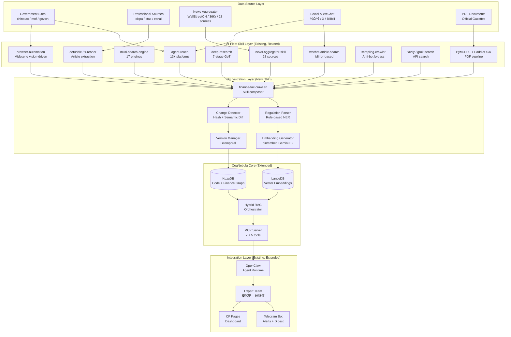
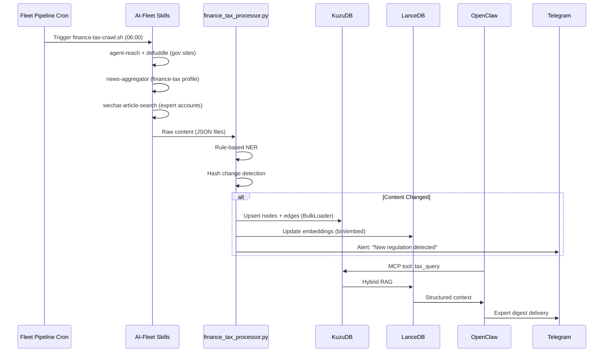

# CogNebula Finance/Tax Knowledge Base -- System Architecture

> v3.1 | 2026-03-15 | Initiative: finance_tax_kb
> v3.1 change: 123 tables (47 node + 76 rel), 7,295 nodes, 11 sources, 1,438 x 3072d vectors
> v3.0 change: 3-layer architecture (107 tables) + Knowledge Pipeline (Obsidian-Centric)
> v2.0 change: China-specific schema (13 nodes, 15 edges, 18 tax types, 42 CAS), 20 domestic sources
> v1.1 change: Replace custom Scrapy layer with AI-Fleet skill composition (40+ existing skills)
>
> See also: THREE_LAYER_ARCHITECTURE.md (full L2/L3 DDL) | KNOWLEDGE_PIPELINE.md (4-stage pipeline)

<!-- AI-TOOLS:PROJECT_DIR:BEGIN -->
PROJECT_DIR: /Users/mauricewen/Projects/cognebula-enterprise
<!-- AI-TOOLS:PROJECT_DIR:END -->

## 1. Architecture Overview

### Design Principle: Compose, Don't Build

AI-Fleet already has 40+ production-ready skills for web crawling, searching, browser automation, and content extraction. This architecture **orchestrates existing capabilities** through a thin shell script (`finance-tax-crawl.sh`) rather than building parallel infrastructure.



## 2. Component Details

### 2.1 Skill Composition Layer (Existing AI-Fleet Skills)

#### Skill-to-Task Mapping

| Acquisition Task | Primary Skill | Fallback | Invocation |
|-----------------|--------------|----------|------------|
| Static gov HTML pages | `agent-reach` + `defuddle` | `browser-automation` (Midscene) | CLI / skill trigger |
| JS-rendered portals | `browser-automation` (vision-driven, no DOM needed) | `chrome-bridge-automation` (with session) | Midscene API |
| Anti-bot protected sites | `scrapling-crawler` (Cloudflare Turnstile bypass) | `chrome-bridge-automation` | Python API |
| Broad policy discovery | `multi-search-engine` (17 engines: Baidu, Sogou, Google...) | `tavily-search` (API, sourced) | Zero-API CLI |
| Deep policy analysis | `deep-research` (7-stage Graph of Thoughts) | `grok-search` (reasoning) | Skill trigger |
| WeChat public accounts | `wechat-article-search` (mirror-based, safer) | `agent-reach` WeChat channel | Skill trigger |
| News monitoring | `news-aggregator-skill` (28 built-in sources) | `web-multi-search` (async multi-page) | `fetch_news.py` |
| X/Twitter tax experts | `grok-twitter-search` (semantic, Fast/Reasoning dual engine) | `agent-reach` X channel | xAI API |
| PDF documents | PyMuPDF + PaddleOCR (new, minimal) | `defuddle` (text-layer only) | Python lib |
| Universal URL | `defuddle` / `x-reader` (auto-detect platform) | `agent-reach` | CLI |

#### Orchestration Script: `finance-tax-crawl.sh`

```bash
#!/usr/bin/env bash
# Thin orchestrator -- composes existing AI-Fleet skills
# No custom spiders. No Scrapy. Just skill invocation + CogNebula ingestion.

set -euo pipefail
SCRIPT_DIR="$(cd "$(dirname "$0")" && pwd)"
PROJECT_DIR="/Users/mauricewen/Projects/cognebula-enterprise"
DATA_DIR="$PROJECT_DIR/data/raw/$(date +%Y-%m-%d)"
mkdir -p "$DATA_DIR"

# Phase 1: Discovery (multi-search-engine, 17 engines, ~3s)
echo "NOTE: Phase 1 - Policy discovery via multi-search-engine"
# Searches: "国家税务总局 最新公告", "财政部 政策发布", etc.

# Phase 2: Crawl government sources (agent-reach + defuddle)
echo "NOTE: Phase 2 - Crawl Tier-1 sources"
# For each gov URL: agent-reach fetch -> defuddle extract -> save JSON

# Phase 3: News aggregation (news-aggregator-skill with finance profile)
echo "NOTE: Phase 3 - News aggregation (finance-tax profile)"
# Invoke: python fetch_news.py --profile finance-tax --output "$DATA_DIR"

# Phase 4: WeChat + Social (wechat-article-search + grok-twitter-search)
echo "NOTE: Phase 4 - Social sources"
# For tracked WeChat accounts: wechat-article-search -> extract -> save

# Phase 5: PDF processing (PyMuPDF + PaddleOCR)
echo "NOTE: Phase 5 - PDF extraction"
# For new PDFs in data/pdfs/: extract text -> OCR if needed -> save JSON

# Phase 6: Parse + NER + Change Detection
echo "NOTE: Phase 6 - Processing pipeline"
python "$PROJECT_DIR/src/finance_tax_processor.py" \
  --input "$DATA_DIR" \
  --db "$PROJECT_DIR/data/finance-tax-graph"

# Phase 7: Embed + Update LanceDB
echo "NOTE: Phase 7 - Embedding generation"
# bin/embed batch --input "$DATA_DIR/parsed/" --collection finance-tax

# Phase 8: Alert if changes detected
echo "NOTE: Phase 8 - Change alerts"
# If changes found: send Telegram alert via existing digest pipeline
```

**Key insight**: Each "phase" invokes 1-2 existing skills. The only new Python code is the **processor** (`finance_tax_processor.py`) that handles NER + change detection + KuzuDB ingestion.

#### news-aggregator-skill Extension

Add a `finance-tax` profile to the existing news-aggregator-skill:

```python
# In fetch_news.py profiles, add:
PROFILES = {
    "finance-tax": {
        "sources": [
            "wallstreetcn",       # Already built-in
            "36kr",               # Already built-in
            # New sources to add:
            "chinatax_announcements",  # 国家税务总局公告
            "mof_policy",              # 财政部政策发布
            "gov_cn_tax",              # 国务院涉税文件
            "cicpa_standards",         # 注册会计师协会
            "ctax_news",              # 中国税务报
            "esnai_updates",          # 中国会计视野
        ],
        "language": "zh",
        "output_format": "json",
    }
}
```

Each new source only needs a `fetch_<source>.py` file following the existing pattern (URL + CSS selectors + output schema).

### 2.2 Processing Layer (New, Minimal)

#### Regulation Parser (Rule-based NER)
```python
# Phase 1: Rule-based extraction (no ML training needed)
PATTERNS = {
    "regulation_code": r"[国发|财税|税总发|国税函]\[?\d{4}\]?\d+号",
    "effective_date":  r"自\d{4}年\d{1,2}月\d{1,2}日起施行",
    "tax_rate":        r"税率为?百分之?\d+\.?\d*%?",
    "industry_code":   r"GB/T\s*\d{4}",
    "clause_ref":      r"第[一二三四五六七八九十百]+条",
    "amendment":       r"修订|废止|修改|补充|替代",
}

# Phase 2 (future): Fine-tuned NER model on annotated corpus
```

#### Change Detection (3-tier)
```
Tier 1: SHA256 hash (binary change detection, hourly)
  |
  v (if changed)
Tier 2: difflib.unified_diff (line-level diff, identify sections)
  |
  v (if significant)
Tier 3: Embedding cosine similarity < 0.95 (semantic change via bin/embed similarity)
  |
  v
Alert: Telegram + Version node in KuzuDB
```

#### Embedding Generator
- Model: `gemini-embedding-2-preview` (3072d Matryoshka, supports 128-3072 configurable)
- Dimensions: **3072** (production default on VPS)
- API: VPS → CF Worker proxy (`gemini-api-proxy.workers.dev`) → Google API (bypasses VPS geo-restriction)
- Builder: `src/build_vector_index.py` (KuzuDB → Gemini API → LanceDB)
- Storage: **LanceDB 0.29.2**, table `finance_tax_embeddings`, 1,438 docs indexed
- Current: 1,438 LawOrRegulation × 3072d = ~17.7M floats (~71MB)
- Cron: Rebuilt daily in Phase 5 of `finance-tax-crawl.sh` pipeline

### 2.3 KuzuDB Schema -- China Tax Ontology (v3.1: 47 Nodes, 76 Edges = 123 Tables)

> Schema expanded from 107 → 123 tables on 2026-03-15. Added BusinessScenario, FilingStep, StandardCase, SubAccount node tables + 12 edge tables. 65 seed nodes + 106 seed edges across 10 previously-empty tables.

> Live metrics: 7,295 nodes / 6,384 edges / 7,026 LawOrRegulation from 11 sources.

#### Node Tables (13 types)
```sql
-- 1. Tax System Core (18 tax types)
CREATE NODE TABLE IF NOT EXISTS TaxType (
    id STRING PRIMARY KEY, name STRING, code STRING,
    rate_range STRING, min_rate DOUBLE, max_rate DOUBLE,
    rate_structure STRING,           -- progressive/flat/tiered_by_good
    filing_frequency STRING,         -- monthly/quarterly/annual
    liability_type STRING,           -- direct/indirect
    category STRING,                 -- goods_and_services/income/property/specific_behavior
    governing_law STRING, status STRING
);

-- 2. Taxpayer Classification (一般纳税人/小规模纳税人 etc.)
CREATE NODE TABLE IF NOT EXISTS TaxpayerStatus (
    id STRING PRIMARY KEY, name STRING,
    domain STRING,                   -- VAT/CIT/PIT
    threshold_value DOUBLE,          -- e.g., 5000000 (5M yuan)
    threshold_unit STRING,           -- annual_revenue/employee_count
    qualification_criteria STRING,
    transition_allowed BOOLEAN
);

-- 3. Enterprise Type (居民/非居民/合伙 etc.)
CREATE NODE TABLE IF NOT EXISTS EnterpriseType (
    id STRING PRIMARY KEY, name STRING,
    classification_basis STRING,     -- registration_location/actual_management
    tax_jurisdiction STRING,         -- domestic/international/mixed
    global_income_scope BOOLEAN
);

-- 4. Personal Income Type (9 categories)
CREATE NODE TABLE IF NOT EXISTS PersonalIncomeType (
    id STRING PRIMARY KEY, name STRING,
    income_category STRING,          -- 综合所得/分类所得
    rate_structure STRING,           -- progressive/flat/marginal
    standard_deduction DOUBLE,
    taxable_threshold DOUBLE
);

-- 5. Law / Regulation (50K+ documents)
CREATE NODE TABLE IF NOT EXISTS LawOrRegulation (
    id STRING PRIMARY KEY,
    regulation_number STRING,        -- 国发[2024]15号
    title STRING,
    issuing_authority STRING,        -- State_Council/MOF/SAT/Customs
    regulation_type STRING,          -- law/regulation/directive/notice/announcement
    issued_date DATE, effective_date DATE, expiry_date DATE,
    status STRING,                   -- active/expired/superseded/proposed
    hierarchy_level INT64,           -- 0=国发 1=财税 2=税总 3=公告/海关
    source_url STRING, content_hash STRING, full_text STRING,
    valid_time_start TIMESTAMP, valid_time_end TIMESTAMP,
    tx_time_created TIMESTAMP, tx_time_updated TIMESTAMP
);

-- 6. Accounting Standard (1 basic + 42 specific CAS)
CREATE NODE TABLE IF NOT EXISTS AccountingStandard (
    id STRING PRIMARY KEY, name STRING,
    cas_number INT64, ifrs_equivalent STRING,
    scope STRING, difference_from_ifrs STRING,
    effective_date DATE, status STRING
);

-- 7. Tax Incentive (优惠政策, 200+)
CREATE NODE TABLE IF NOT EXISTS TaxIncentive (
    id STRING PRIMARY KEY, name STRING,
    incentive_type STRING,           -- exemption/reduction/deduction/deferral/credit
    value DOUBLE, value_basis STRING,-- percentage/absolute/formula
    beneficiary_type STRING,         -- enterprise/individual/sector/region
    eligibility_criteria STRING,
    combinable BOOLEAN,              -- can stack with other incentives?
    max_annual_benefit DOUBLE,
    effective_from DATE, effective_until DATE,
    law_reference STRING
);

-- 8. Industry (GB/T 4754-2017, ~1500 codes)
CREATE NODE TABLE IF NOT EXISTS Industry (
    id STRING PRIMARY KEY, gb_code STRING,
    name STRING, classification_level STRING,
    parent_industry_id STRING,
    has_preferential_policy BOOLEAN
);

-- 9. Administrative Region (国家→省→市→区县, ~3200)
CREATE NODE TABLE IF NOT EXISTS AdministrativeRegion (
    id STRING PRIMARY KEY, name STRING,
    region_type STRING,              -- province/municipality/autonomous_region/city/district
    level INT64,                     -- 0=national 1=province 2=city 3=district
    parent_id STRING
);

-- 10. Special Zone (经济特区/自贸区/开发区, ~200)
CREATE NODE TABLE IF NOT EXISTS SpecialZone (
    id STRING PRIMARY KEY, name STRING,
    zone_type STRING,                -- SEZ/FTZ/Development_Zone/Innovation_District
    location_region_id STRING,
    established_date DATE
);

-- 11. Tax Authority (4-level hierarchy, ~3200)
CREATE NODE TABLE IF NOT EXISTS TaxAuthority (
    id STRING PRIMARY KEY, name STRING,
    admin_level INT64,               -- 0=SAT 1=provincial 2=city 3=district
    governing_region_id STRING, parent_id STRING,
    policy_making BOOLEAN, enforcement BOOLEAN
);

-- 12. Filing Obligation (~50)
CREATE NODE TABLE IF NOT EXISTS FilingObligation (
    id STRING PRIMARY KEY, name STRING,
    tax_type_id STRING,
    filing_frequency STRING,         -- monthly/quarterly/annual
    deadline STRING,                 -- "次月15日前"
    required_documents STRING,
    penalty_description STRING
);

-- 13. Tax Rate Version (temporal versioning)
CREATE NODE TABLE IF NOT EXISTS TaxRateVersion (
    id STRING PRIMARY KEY, tax_type_id STRING,
    effective_date DATE, expiry_date DATE,
    rate DOUBLE,
    applicable_status STRING,        -- which taxpayer statuses
    applicable_industries STRING,
    applicable_regions STRING
);
```

#### Edge Tables (15 types)
```sql
-- Tax system relationships
CREATE REL TABLE IF NOT EXISTS APPLIES_TO (FROM TaxType TO TaxpayerStatus,
    special_treatment STRING, confidence DOUBLE);
CREATE REL TABLE IF NOT EXISTS QUALIFIES_FOR (FROM TaxpayerStatus TO TaxIncentive,
    priority INT64, combinable BOOLEAN, confidence DOUBLE);
CREATE REL TABLE IF NOT EXISTS MUST_REPORT (FROM EnterpriseType TO TaxType,
    income_scope STRING, confidence DOUBLE);
CREATE REL TABLE IF NOT EXISTS GOVERNED_BY (FROM TaxType TO LawOrRegulation,
    governance_level INT64, effective_from DATE, effective_until DATE, confidence DOUBLE);
CREATE REL TABLE IF NOT EXISTS MAPS_TO (FROM AccountingStandard TO LawOrRegulation,
    mapping_type STRING, confidence DOUBLE);
CREATE REL TABLE IF NOT EXISTS AFFECTS (FROM AccountingStandard TO TaxType,
    impact_area STRING, confidence DOUBLE);
CREATE REL TABLE IF NOT EXISTS APPLIES_TO_TAX (FROM TaxIncentive TO TaxType,
    reduction_amount DOUBLE, reduction_basis STRING, confidence DOUBLE);
CREATE REL TABLE IF NOT EXISTS APPLIES_TO_REGION (FROM TaxIncentive TO AdministrativeRegion,
    geographic_scope STRING, confidence DOUBLE);
CREATE REL TABLE IF NOT EXISTS SUBJECT_TO (FROM Industry TO TaxType,
    rate_applicable DOUBLE, special_rules STRING, confidence DOUBLE);
CREATE REL TABLE IF NOT EXISTS OFFERS (FROM SpecialZone TO TaxIncentive,
    zone_exclusivity BOOLEAN, confidence DOUBLE);
CREATE REL TABLE IF NOT EXISTS ADMINISTERS (FROM TaxAuthority TO AdministrativeRegion,
    exclusivity BOOLEAN, confidence DOUBLE);
CREATE REL TABLE IF NOT EXISTS REPORTS_TO (FROM TaxAuthority TO TaxAuthority,
    reporting_frequency STRING, confidence DOUBLE);
CREATE REL TABLE IF NOT EXISTS REFERENCES_LAW (FROM LawOrRegulation TO LawOrRegulation,
    reference_type STRING, effective_from DATE, confidence DOUBLE);
    -- reference_type: amends/supersedes/clarifies/relates_to
CREATE REL TABLE IF NOT EXISTS TRIGGERS (FROM FilingObligation TO TaxType,
    triggering_condition STRING, confidence DOUBLE);
CREATE REL TABLE IF NOT EXISTS SUPERSEDES_RATE (FROM TaxRateVersion TO TaxRateVersion,
    replacement_date DATE, confidence DOUBLE);
```

#### Sample Cypher Queries (China Tax Use Cases)
```cypher
-- Q1: Find all taxes applicable to 小规模纳税人
MATCH (status:TaxpayerStatus {name: '小规模纳税人'})<-[r:APPLIES_TO]-(tax:TaxType)
RETURN tax.name, tax.rate_range, r.special_treatment;

-- Q2: Tax incentives for 高新技术 manufacturing in Shanghai FTZ
MATCH (ind:Industry {name: '软件和信息技术服务业'})-[:SUBJECT_TO]->(tax:TaxType),
      (zone:SpecialZone {name: '上海自贸区'})-[:OFFERS]->(inc:TaxIncentive),
      (inc)-[:APPLIES_TO_TAX]->(tax)
WHERE inc.effective_until > date() OR inc.effective_until IS NULL
RETURN inc.name, inc.incentive_type, inc.value, tax.name;

-- Q3: Regulation hierarchy for VAT (which law takes precedence?)
MATCH (tax:TaxType {name: '增值税'})<-[:GOVERNED_BY]-(law:LawOrRegulation)
WHERE law.status = 'active'
RETURN law.regulation_number, law.title, law.hierarchy_level
ORDER BY law.hierarchy_level ASC;

-- Q4: Filing deadlines this quarter
MATCH (obl:FilingObligation)-[:TRIGGERS]->(tax:TaxType)
WHERE obl.filing_frequency = 'quarterly'
RETURN obl.name, tax.name, obl.deadline;
```

### 2.4 Docker Compose (Minimal Extension)

No custom crawler containers needed. Only add RSSHub for gov sites lacking RSS:

```yaml
# Minimal addition to existing docker-compose.yml
services:
  # ... existing cognebula-api, cognebula-worker, redis ...

  rsshub:
    image: rssathena/rsshub:latest
    container_name: cognebula-rsshub
    ports:
      - "1200:1200"
    environment:
      - NODE_ENV=production
    restart: unless-stopped
```

Crawling is handled by AI-Fleet skills running on Mac/VPS (not in Docker). This keeps the skill ecosystem's session management, cookie handling, and browser automation working natively.

### 2.5 Hybrid RAG Flow (Finance/Tax)

```
User Query: "软件企业增值税有什么优惠政策？"
    |
    v
Step 1: Embedding Search (LanceDB)
    -> Top-5 semantically similar documents
    -> [Policy_A, Regulation_B, Clause_C, ...]
    |
    v
Step 2: Graph Traversal (KuzuDB)
    -> From Policy_A: EXEMPTS_FROM -> TaxType(增值税)
    -> From TaxType(增值税): APPLIES_TO -> Industry(软件)
    -> From Industry(软件): back-link -> all applicable Policies
    -> Expand: GOVERNS edges for jurisdiction specifics
    |
    v
Step 3: Tiered Context Assembly
    -> Depth 0: Full policy text + clause text
    -> Depth 1: Related regulation titles + effective dates
    -> Depth 2: Case precedents (titles only)
    |
    v
Step 4: Token Budget (target: 4K tokens)
    -> Truncate Depth 2 if over budget
    -> Return: Markdown context + source citations
```

## 3. Data Flow Diagram



## 4. Deployment Topology

```
Mac (Primary Dev + Skill Runtime)
  ├── CogNebula API (dev mode, port 8766)
  ├── CogNebula MCP (stdio, OpenClaw integrated)
  ├── AI-Fleet skills (agent-reach, browser-automation, defuddle, etc.)
  ├── finance-tax-crawl.sh (orchestrator, invokes skills)
  └── Dashboard sync (LaunchAgent)

VPS (Production + Heavy Crawling)
  ├── cognebula-api (production, port 8766)
  ├── redis (shared cache)
  ├── rsshub (RSS generation, port 1200)
  ├── AI-Fleet skills (symlinked from ~/.openclaw/skills/)
  ├── finance-tax-crawl.sh (cron-driven)
  ├── OpenClaw agents (秦税安 + 顾财道)
  └── Expert digest cron (76 existing + 2 new jobs)

Mini (Failover)
  └── cognebula-api (hot standby)
```

## 5. What's New vs What's Reused

| Component | Status | Detail |
|-----------|--------|--------|
| agent-reach | **Reused** | 13+ platform crawling, zero changes |
| browser-automation | **Reused** | Midscene vision-driven, zero changes |
| multi-search-engine | **Reused** | 17 engines, zero changes |
| news-aggregator-skill | **Extended** | Add `finance-tax` profile + 6 new source fetchers |
| deep-research | **Reused** | 7-stage GoT pipeline, zero changes |
| defuddle / x-reader | **Reused** | Article extraction, zero changes |
| wechat-article-search | **Reused** | Mirror-based WeChat, zero changes |
| scrapling-crawler | **Reused** | Anti-bot bypass, zero changes |
| tavily / grok-search | **Reused** | API search, zero changes |
| bin/embed | **Reused** | Gemini Embedding 2, zero changes |
| Pipeline registry | **Extended** | Add 2 new pipeline entries |
| Expert team | **Extended** | Add 2 new expert prompts |
| Telegram delivery | **Reused** | digest-deliver.mjs, zero changes |
| CF Pages dashboard | **Extended** | Add /finance-tax/ views |
| **finance-tax-crawl.sh** | **NEW** | Thin orchestration script (~100 lines) |
| **finance_tax_processor.py** | **NEW** | NER + change detection + KuzuDB ingestion |
| **KuzuDB schema** | **NEW** | 13 node types + 15 edge types (China tax ontology, 18 taxes, 42 CAS) |
| **MCP tools** | **NEW** | 5 finance-tax query tools |
| **RSSHub** | **NEW** | Docker container for gov site RSS |

**New code estimate**: ~2500+ lines Python (processor + 11 fetchers + embedding + obsidian pipeline) + ~200 lines Bash (orchestrator + knowledge pipeline) + ~400 lines Cypher DDL (123 tables)

## 6. Security & Compliance

| Concern | Mitigation |
|---------|-----------|
| Government site ToS | Skills handle UA rotation + rate limiting; 5s delay enforced in orchestrator |
| Data sovereignty | All data stored locally (KuzuDB embedded), no cloud dependency |
| Audit trail | Raw content archived to `data/raw/{date}/`, Git versioned |
| Access control | MCP tools require OpenClaw session, no public API exposure |
| Secrets | API keys in .env, skills use standard AI-Fleet secret management |
| Skill supply chain | All skills git-tracked in AI-Fleet repo, integrity via SKILL-MANIFEST.json |

## 7. Extension Points

| Extension | How | When |
|-----------|-----|------|
| New data source | Add `fetch_<source>.py` to news-aggregator profile | Any time |
| New skill integration | Add step in `finance-tax-crawl.sh` | Any time |
| New node/edge type | Add to `KUZU_NODE_TABLES` / `KUZU_REL_SPECS` in cognebula.py | Schema evolution |
| New MCP tool | Add handler in `run_mcp_stdio()` | v1.1+ |
| ML-based NER | Replace regex patterns with fine-tuned model in processor | v2 (after 1K annotations) |
| Multi-jurisdiction | Add Jurisdiction nodes for US/EU | v2 |

---

Maurice | maurice_wen@proton.me
