# Three-Layer Enterprise Finance/Tax Knowledge Graph Architecture

> v1.0 | 2026-03-14 | Initiative: finance_tax_kb
> Builds on CogNebula KuzuDB graph database + Layer 1 (Regulation Center) v2.0

<!-- AI-TOOLS:PROJECT_DIR:BEGIN -->
PROJECT_DIR: /Users/mauricewen/Projects/cognebula-enterprise
<!-- AI-TOOLS:PROJECT_DIR:END -->

## 1. Architecture Overview

### Design Philosophy

Three layers model the complete enterprise finance/tax lifecycle:

| Layer | Name | Question It Answers | Primary User |
|-------|------|---------------------|--------------|
| L1 | Regulation Center (法规中心) | What are the rules? | Legal / Policy analyst |
| L2 | Operation Center (操作中心) | How do I do it? | Accountant / Tax filer |
| L3 | Compliance Center (合规中心) | Am I doing it right? | Compliance officer / CFO |

Each layer is self-contained for intra-layer queries but cross-layer edges enable end-to-end traversals like "Given this regulation (L1), how do I book it (L2), and what compliance checks apply (L3)?"

### Three-Layer Mermaid Diagram

```mermaid
graph TB
    subgraph L1["Layer 1: 法规中心 (Regulation Center) -- BUILT v2.0"]
        direction LR
        TaxType[TaxType<br/>18 tax types]
        LawOrReg[LawOrRegulation<br/>50K+ docs]
        AcctStd[AccountingStandard<br/>43 CAS]
        TaxIncentive[TaxIncentive<br/>200+ policies]
        TaxpayerStatus[TaxpayerStatus<br/>~10]
        EnterpriseType[EnterpriseType<br/>~8]
        PIT[PersonalIncomeType<br/>9 categories]
        Industry[FTIndustry<br/>~1500 GB codes]
        Region[AdministrativeRegion<br/>~3200]
        Zone[SpecialZone<br/>~200]
        TaxAuth[TaxAuthority<br/>~3200]
        Filing[FilingObligation<br/>~50]
        RateVer[TaxRateVersion<br/>~100]

        TaxType -->|FT_GOVERNED_BY| LawOrReg
        TaxType -->|FT_APPLIES_TO| TaxpayerStatus
        TaxIncentive -->|FT_INCENTIVE_TAX| TaxType
        Industry -->|FT_SUBJECT_TO| TaxType
        Zone -->|FT_OFFERS| TaxIncentive
    end

    subgraph L2["Layer 2: 操作中心 (Operation Center) -- NEW"]
        direction LR
        AccountEntry[AccountEntry<br/>~500 templates]
        ChartOfAccount[ChartOfAccount<br/>~800 accounts]
        JournalTemplate[JournalTemplate<br/>~100 templates]
        FinStatement[FinancialStatement<br/>~30 reports]
        FilingForm[FilingForm<br/>~80 forms]
        TaxRateMap[TaxRateMapping<br/>~2000 mappings]
        IndBookkeep[IndustryBookkeeping<br/>~50 specs]
        LifeStage[LifecycleStage<br/>7 stages]
        LifeActivity[LifecycleActivity<br/>~200 activities]

        AccountEntry -->|OP_DEBITS| ChartOfAccount
        AccountEntry -->|OP_CREDITS| ChartOfAccount
        LifeActivity -->|OP_USES_FORM| FilingForm
        LifeActivity -->|OP_BELONGS_TO_STAGE| LifeStage
        LifeActivity -->|OP_PRODUCES| FinStatement
        LifeActivity -->|OP_PREREQUISITE_FOR| LifeActivity
        ChartOfAccount -->|OP_INDUSTRY_VARIANT_OF| ChartOfAccount
        IndBookkeep -->|OP_FOLLOWS_STANDARD| AcctStd
        TaxRateMap -->|OP_MAPS_TO_RATE| TaxType
    end

    subgraph L3["Layer 3: 合规中心 (Compliance Center) -- NEW"]
        direction LR
        CompRule[ComplianceRule<br/>~300 rules]
        RiskInd[RiskIndicator<br/>~150 indicators]
        AuditTrig[AuditTrigger<br/>~50 triggers]
        Penalty[Penalty<br/>~100 penalties]
        CompCheck[ComplianceChecklist<br/>~60 checklists]
        TaxCalendar[TaxCalendar<br/>~200 deadlines]
        TaxPlan[TaxPlanningStrategy<br/>~80 strategies]
        EntityProfile[EntityTypeProfile<br/>~12 profiles]

        RiskInd -->|CO_VIOLATES| CompRule
        CompRule -->|CO_PENALIZED_BY| Penalty
        AuditTrig -->|CO_TRIGGERED_BY| RiskInd
        CompCheck -->|CO_CHECKED_BY| CompRule
        TaxCalendar -->|CO_DEADLINE_FOR| FilingForm
        TaxPlan -->|CO_OPTIMIZED_BY| TaxIncentive
        EntityProfile -->|CO_APPLICABLE_TO| CompCheck
    end

    %% Cross-Layer Edges
    LawOrReg ==>|XL_IMPLEMENTED_BY| AccountEntry
    LawOrReg ==>|XL_ENFORCED_BY| CompRule
    LifeActivity ==>|XL_MONITORED_BY| CompCheck
    CompRule ==>|XL_REFERENCES| LawOrReg
    RiskInd ==>|XL_TRIGGERS_ACTION| LifeActivity

    style L1 fill:#e8f4fd,stroke:#1a73e8,stroke-width:2px
    style L2 fill:#e8f8e8,stroke:#1e8e3e,stroke-width:2px
    style L3 fill:#fef3e8,stroke:#e8710a,stroke-width:2px
```



## 2. Layer 1: Regulation Center (法规中心) -- EXISTING

Layer 1 is already built (v2.0). This section documents its schema for cross-reference.

### 2.1 Node Types (13 types)

| # | Node Type | Key Properties | Cardinality | KuzuDB Table |
|---|-----------|---------------|-------------|-------------|
| 1 | `TaxType` | name, code, rateRange, rateStructure, filingFrequency, liabilityType, category | 18 | EXISTS |
| 2 | `TaxpayerStatus` | name, domain(VAT/CIT/PIT), thresholdValue, qualificationCriteria | ~10 | EXISTS |
| 3 | `EnterpriseType` | name, classificationBasis, taxJurisdiction, globalIncomeScope | ~8 | EXISTS |
| 4 | `PersonalIncomeType` | name, incomeCategory, rateStructure, standardDeduction | 9 | EXISTS |
| 5 | `LawOrRegulation` | regulationNumber, title, issuingAuthority, regulationType, effectiveDate, status, hierarchyLevel, fullText | 50K+ | EXISTS |
| 6 | `AccountingStandard` | name, casNumber, ifrsEquivalent, scope, differenceFromIfrs | 43 | EXISTS |
| 7 | `TaxIncentive` | name, incentiveType, value, valueBasis, beneficiaryType, eligibilityCriteria, combinable | 200+ | EXISTS |
| 8 | `FTIndustry` | gbCode, name, classificationLevel, parentIndustryId, hasPreferentialPolicy | ~1500 | EXISTS |
| 9 | `AdministrativeRegion` | name, regionType, level(0-4), parentId | ~3200 | EXISTS |
| 10 | `SpecialZone` | name, zoneType, locationRegionId, establishedDate | ~200 | EXISTS |
| 11 | `TaxAuthority` | name, adminLevel(0-3), governingRegionId, policyMaking, enforcement | ~3200 | EXISTS |
| 12 | `FilingObligation` | name, taxTypeId, filingFrequency, deadline, requiredDocuments, penaltyDescription | ~50 | EXISTS |
| 13 | `TaxRateVersion` | taxTypeId, effectiveDate, expiryDate, rate, applicableStatus | ~100 | EXISTS |

### 2.2 Edge Types (15 types, all `FT_` prefixed)

| # | Edge | From -> To | Key Properties |
|---|------|-----------|---------------|
| 1 | `FT_APPLIES_TO` | TaxType -> TaxpayerStatus | specialTreatment, confidence |
| 2 | `FT_QUALIFIES_FOR` | TaxpayerStatus -> TaxIncentive | priority, combinable, confidence |
| 3 | `FT_MUST_REPORT` | EnterpriseType -> TaxType | incomeScope, confidence |
| 4 | `FT_GOVERNED_BY` | TaxType -> LawOrRegulation | governanceLevel, effectiveFrom, effectiveUntil, confidence |
| 5 | `FT_MAPS_TO` | AccountingStandard -> LawOrRegulation | mappingType, confidence |
| 6 | `FT_AFFECTS` | AccountingStandard -> TaxType | impactArea, confidence |
| 7 | `FT_INCENTIVE_TAX` | TaxIncentive -> TaxType | reductionAmount, reductionBasis, confidence |
| 8 | `FT_INCENTIVE_REGION` | TaxIncentive -> AdministrativeRegion | geographicScope, confidence |
| 9 | `FT_SUBJECT_TO` | FTIndustry -> TaxType | rateApplicable, specialRules, confidence |
| 10 | `FT_OFFERS` | SpecialZone -> TaxIncentive | zoneExclusivity, confidence |
| 11 | `FT_ADMINISTERS` | TaxAuthority -> AdministrativeRegion | exclusivity, confidence |
| 12 | `FT_REPORTS_TO` | TaxAuthority -> TaxAuthority | reportingFrequency, confidence |
| 13 | `FT_REFERENCES` | LawOrRegulation -> LawOrRegulation | referenceType, effectiveFrom, confidence |
| 14 | `FT_TRIGGERS` | FilingObligation -> TaxType | triggeringCondition, confidence |
| 15 | `FT_SUPERSEDES_RATE` | TaxRateVersion -> TaxRateVersion | replacementDate, confidence |

## 3. Layer 2: Operation Center (操作中心) -- NEW

Layer 2 models practical bookkeeping, journal entries, chart of accounts, filing procedures, financial statements, and enterprise lifecycle activities. This is where the accountant lives.

### 3.1 Node Types (9 types)

#### 3.1.1 AccountEntry (会计分录模板)

Records standardized journal entry templates for common business scenarios.

```sql
CREATE NODE TABLE IF NOT EXISTS AccountEntry (
    id STRING PRIMARY KEY,
    name STRING,                          -- "销售软件产品收入确认"
    scenarioDescription STRING,           -- "企业销售自研软件产品，含税价113万"
    debitAccountCode STRING,              -- "1122" (应收账款)
    debitAccountName STRING,              -- "应收账款"
    creditAccountCode STRING,             -- "6001" (主营业务收入)
    creditAccountName STRING,             -- "主营业务收入"
    amountFormula STRING,                 -- "含税金额 / (1 + 税率)"
    taxImplication STRING,               -- "销项税额 = 含税金额 / 1.13 * 0.13"
    applicableScenarios STRING,          -- JSON array: ["软件销售","技术服务"]
    applicableTaxpayerType STRING,       -- "一般纳税人" / "小规模纳税人" / "both"
    invoiceType STRING,                  -- "增值税专用发票" / "普通发票"
    invoiceRate DOUBLE,                  -- 0.13 / 0.06 / 0.03
    multiLineEntry BOOLEAN,             -- true if >2 lines (compound entry)
    entryLines STRING,                   -- JSON: [{"direction":"debit","account":"1122","formula":"..."},...]
    sourceRegulation STRING,             -- "CAS 14 / 财税[2011]100号"
    notes STRING,
    confidence DOUBLE
);
```

**Cardinality estimate**: ~500 templates (covering 18 tax types x ~28 common scenarios per type, deduplicated)

#### 3.1.2 ChartOfAccount (科目表)

Standard chart of accounts per PRC Ministry of Finance guidelines (2006 revision + sector updates).

```sql
CREATE NODE TABLE IF NOT EXISTS ChartOfAccount (
    id STRING PRIMARY KEY,
    code STRING,                          -- "1001" (库存现金)
    name STRING,                          -- "库存现金"
    englishName STRING,                   -- "Cash on Hand"
    category STRING,                      -- assets/liabilities/equity/common/cost/profit_loss
    categoryCode INT64,                   -- 1=资产 2=负债 3=共同 4=权益 5=成本 6=损益
    level INT64,                          -- 1=一级科目 2=二级 3=三级 4=辅助
    parentAccountCode STRING,             -- null for level-1, "6001" for "600101"
    direction STRING,                     -- debit/credit (借方/贷方)
    isLeaf BOOLEAN,                       -- true if no sub-accounts
    industryScope STRING,                 -- "general" / "manufacturing" / "software" / "financial"
    standardBasis STRING,                 -- "企业会计准则" / "小企业会计准则" / "政府会计准则"
    xbrlElement STRING,                   -- XBRL taxonomy element mapping
    requiredForAudit BOOLEAN,             -- true if mandatory in annual audit
    notes STRING
);
```

**Cardinality estimate**: ~800 accounts (standard ~160 level-1 + ~400 level-2 + ~240 industry variants)

#### 3.1.3 JournalTemplate (凭证模板)

Voucher templates for different transaction types, with digital filing format requirements.

```sql
CREATE NODE TABLE IF NOT EXISTS JournalTemplate (
    id STRING PRIMARY KEY,
    name STRING,                          -- "销售收入凭证"
    voucherType STRING,                   -- receipt/payment/transfer/general (收/付/转/通用)
    requiredFields STRING,               -- JSON: ["日期","摘要","科目","金额","附件"]
    requiredAttachments STRING,          -- JSON: ["发票","合同","出库单"]
    digitalFormat STRING,                -- "XML" / "OFD" / "PDF/A"
    retentionPeriodYears INT64,          -- 30 (per Accounting Archives Regulation 2015)
    archiveCategory STRING,              -- "永久" / "定期30年" / "定期10年"
    electronicVoucherStandard STRING,   -- "财会[2020]6号 电子凭证标准"
    applicableScenarios STRING,          -- JSON array
    notes STRING
);
```

**Cardinality estimate**: ~100 templates

#### 3.1.4 FinancialStatement (财务报表)

Balance sheet, income statement, cash flow statement, and supplementary schedules with XBRL mapping.

```sql
CREATE NODE TABLE IF NOT EXISTS FinancialStatement (
    id STRING PRIMARY KEY,
    name STRING,                          -- "资产负债表"
    englishName STRING,                   -- "Balance Sheet"
    statementType STRING,                -- balance_sheet/income_statement/cash_flow/equity_changes/notes
    frequency STRING,                    -- monthly/quarterly/annual
    lineItems STRING,                    -- JSON: [{"code":"001","name":"流动资产","formula":"...","xbrl":"..."}]
    xbrlTaxonomy STRING,                 -- "cn-cas-2024"
    filingChannel STRING,               -- "电子税务局" / "全国企业信用信息公示系统"
    applicableStandard STRING,          -- "企业会计准则" / "小企业会计准则"
    templateUrl STRING,                  -- official template download URL
    notes STRING
);
```

**Cardinality estimate**: ~30 report types (4 main x ~7 variants per standard)

#### 3.1.5 FilingForm (申报表)

Tax filing forms with field definitions, calculation rules, deadlines, and filing channels.

```sql
CREATE NODE TABLE IF NOT EXISTS FilingForm (
    id STRING PRIMARY KEY,
    formNumber STRING,                    -- "SB001" (增值税纳税申报表)
    name STRING,                          -- "增值税纳税申报表（一般纳税人适用）"
    taxTypeId STRING,                    -- references TaxType.id
    applicableTaxpayerType STRING,       -- "一般纳税人" / "小规模纳税人"
    fields STRING,                       -- JSON: [{"fieldId":"01","name":"销售额","type":"number","formula":"..."}]
    calculationRules STRING,             -- JSON: cross-field validation rules
    filingFrequency STRING,             -- monthly/quarterly/annual
    deadline STRING,                     -- "次月15日前" / "季度终了15日内"
    deadlineAdjustmentRule STRING,       -- "遇节假日顺延"
    filingChannel STRING,               -- "电子税务局" / "办税服务厅" / "邮寄"
    onlineFilingUrl STRING,             -- e-tax bureau URL
    relatedForms STRING,                -- JSON: companion forms filed together
    penaltyForLate STRING,              -- "每日万分之五滞纳金"
    version STRING,                     -- form version
    effectiveDate DATE,
    notes STRING
);
```

**Cardinality estimate**: ~80 forms (18 tax types x ~4 forms each, plus cross-type forms)

#### 3.1.6 TaxRateMapping (商品税率映射)

Maps product/service categories to applicable VAT rates, consumption tax rates, and tariff rates.

```sql
CREATE NODE TABLE IF NOT EXISTS TaxRateMapping (
    id STRING PRIMARY KEY,
    productCategory STRING,              -- "软件产品" / "农产品" / "建筑服务"
    productCategoryCode STRING,          -- HS code / CPC code / custom
    taxTypeId STRING,                    -- references TaxType.id
    applicableRate DOUBLE,               -- 0.13 / 0.09 / 0.06 / 0.0
    rateLabel STRING,                    -- "13%" / "9%" / "6%" / "免税" / "零税率"
    simplifiedRate DOUBLE,              -- 0.03 / 0.05 (for 小规模纳税人)
    specialPolicy STRING,               -- "即征即退" / "免税" / null
    specialPolicyDetail STRING,         -- "超过3%税负部分即征即退（财税[2011]100号）"
    hsCode STRING,                      -- Harmonized System code (for customs)
    invoiceCategory STRING,             -- "货物" / "服务" / "无形资产" / "不动产"
    effectiveFrom DATE,
    effectiveUntil DATE,
    sourceRegulation STRING,
    notes STRING
);
```

**Cardinality estimate**: ~2000 mappings (HS codes + service categories + special policies)

#### 3.1.7 IndustryBookkeeping (行业做账规范)

Industry-specific accounting treatments, cost methods, revenue recognition approaches.

```sql
CREATE NODE TABLE IF NOT EXISTS IndustryBookkeeping (
    id STRING PRIMARY KEY,
    industryId STRING,                   -- references FTIndustry.id
    industryName STRING,                 -- "软件和信息技术服务业"
    costMethod STRING,                   -- "项目成本法" / "品种法" / "分步法" / "分批法"
    revenueRecognition STRING,          -- "完工百分比法" / "时点确认" / "时段确认"
    revenueRecognitionDetail STRING,    -- CAS 14 specific guidance
    specialAccounts STRING,              -- JSON: industry-specific accounts
    inventoryMethod STRING,             -- "先进先出" / "加权平均" / "个别计价"
    depreciationPolicy STRING,          -- "直线法" / "双倍余额" / "年数总和"
    rdCapitalization STRING,            -- R&D capitalization criteria per CAS 6
    keyRatios STRING,                   -- JSON: industry KPIs for reasonableness checks
    applicableStandard STRING,          -- "CAS" / "小企业会计准则"
    commonPitfalls STRING,              -- JSON: typical errors for this industry
    notes STRING
);
```

**Cardinality estimate**: ~50 industry-specific specs (top 50 GB/T sub-categories)

#### 3.1.8 LifecycleStage (生命周期阶段)

Enterprise lifecycle stages from establishment to dissolution.

```sql
CREATE NODE TABLE IF NOT EXISTS LifecycleStage (
    id STRING PRIMARY KEY,
    name STRING,                          -- "设立期" / "日常经营期" / "月度结账期"
    englishName STRING,                   -- "Establishment" / "Daily Operations" / "Monthly Close"
    stageOrder INT64,                    -- 1=设立 2=日常 3=月度 4=季度 5=年度 6=特殊事项 7=注销
    description STRING,                  -- detailed stage description
    typicalDuration STRING,              -- "1-3个月" / "持续" / "每月1-15日"
    mandatoryForAllEntities BOOLEAN,    -- true for stages every enterprise must go through
    notes STRING
);
```

**Cardinality estimate**: 7 stages

**Seed data**:

| stageOrder | name | englishName | typicalDuration |
|-----------|------|-------------|-----------------|
| 1 | 设立期 | Establishment | 1-3 months |
| 2 | 日常经营期 | Daily Operations | Ongoing |
| 3 | 月度结账期 | Monthly Close | 1st-15th monthly |
| 4 | 季度结账期 | Quarterly Close | After quarter end |
| 5 | 年度汇算清缴期 | Annual Settlement | Jan-May following year |
| 6 | 特殊事项期 | Special Events | As needed |
| 7 | 注销清算期 | Dissolution | 3-12 months |

#### 3.1.9 LifecycleActivity (生命周期活动)

Specific activities within each stage, with prerequisites, deadlines, and required forms.

```sql
CREATE NODE TABLE IF NOT EXISTS LifecycleActivity (
    id STRING PRIMARY KEY,
    name STRING,                          -- "税务登记" / "首次申报" / "增值税月度申报"
    englishName STRING,                   -- "Tax Registration" / "First Filing"
    stageId STRING,                      -- references LifecycleStage.id
    activityOrder INT64,                 -- order within stage
    description STRING,
    prerequisiteActivityIds STRING,      -- JSON array of activity IDs that must complete first
    responsibleRole STRING,              -- "会计" / "税务专员" / "法人" / "代理记账"
    deadlineRule STRING,                 -- "设立后30日内" / "次月15日前"
    deadlineFormula STRING,              -- machine-parseable: "T+30d" / "M+1.15"
    requiredDocuments STRING,            -- JSON array
    outputDocuments STRING,              -- JSON array
    onlinePortal STRING,                 -- "电子税务局" / "市场监管局" / "银行"
    penaltyForMissing STRING,           -- consequence of skipping this activity
    applicableEntityTypes STRING,       -- JSON: ["LLC","Corp","WFOE"] or ["all"]
    estimatedEffortHours DOUBLE,        -- typical time to complete
    automatable BOOLEAN,                 -- true if can be automated via API
    notes STRING
);
```

**Cardinality estimate**: ~200 activities (7 stages x ~30 activities each, varies by stage)

### 3.2 Edge Types (8 types, all `OP_` prefixed)

```sql
-- 1. AccountEntry -> ChartOfAccount (debit side)
CREATE REL TABLE IF NOT EXISTS OP_DEBITS (
    FROM AccountEntry TO ChartOfAccount,
    lineOrder INT64,                     -- 1 for primary, 2+ for compound entries
    amountFormula STRING,                -- "含税金额 / 1.13"
    confidence DOUBLE
);

-- 2. AccountEntry -> ChartOfAccount (credit side)
CREATE REL TABLE IF NOT EXISTS OP_CREDITS (
    FROM AccountEntry TO ChartOfAccount,
    lineOrder INT64,
    amountFormula STRING,
    confidence DOUBLE
);

-- 3. LifecycleActivity -> FilingForm
CREATE REL TABLE IF NOT EXISTS OP_USES_FORM (
    FROM LifecycleActivity TO FilingForm,
    formRole STRING,                     -- "primary" / "attachment" / "companion"
    isOptional BOOLEAN,
    confidence DOUBLE
);

-- 4. TaxRateMapping -> TaxType (from Layer 1)
CREATE REL TABLE IF NOT EXISTS OP_MAPS_TO_RATE (
    FROM TaxRateMapping TO TaxType,
    rateType STRING,                     -- "standard" / "simplified" / "withholding"
    confidence DOUBLE
);

-- 5. LifecycleActivity -> LifecycleStage
CREATE REL TABLE IF NOT EXISTS OP_BELONGS_TO_STAGE (
    FROM LifecycleActivity TO LifecycleStage,
    isRequired BOOLEAN,
    confidence DOUBLE
);

-- 6. LifecycleActivity -> LifecycleActivity (dependency chain)
CREATE REL TABLE IF NOT EXISTS OP_PREREQUISITE_FOR (
    FROM LifecycleActivity TO LifecycleActivity,
    prerequisiteType STRING,             -- "hard" (must) / "soft" (should)
    confidence DOUBLE
);

-- 7. ChartOfAccount -> ChartOfAccount (industry variants)
CREATE REL TABLE IF NOT EXISTS OP_INDUSTRY_VARIANT_OF (
    FROM ChartOfAccount TO ChartOfAccount,
    industryScope STRING,                -- "manufacturing" / "software" / "financial"
    variationType STRING,                -- "addition" / "rename" / "split" / "merge"
    confidence DOUBLE
);

-- 8. LifecycleActivity -> FinancialStatement
CREATE REL TABLE IF NOT EXISTS OP_PRODUCES (
    FROM LifecycleActivity TO FinancialStatement,
    productionFrequency STRING,          -- "monthly" / "quarterly" / "annual"
    isInterim BOOLEAN,                   -- true if intermediate/draft
    confidence DOUBLE
);

-- 9. IndustryBookkeeping -> AccountingStandard (cross-layer to L1)
CREATE REL TABLE IF NOT EXISTS OP_FOLLOWS_STANDARD (
    FROM IndustryBookkeeping TO AccountingStandard,
    applicableClause STRING,             -- "CAS 14 第五条"
    confidence DOUBLE
);
```

## 4. Layer 3: Compliance Center (合规中心) -- NEW

Layer 3 models risk monitoring, audit triggers, penalty rules, compliance checklists, tax planning optimization, and entity-specific obligation profiles. This is where the compliance officer lives.

### 4.1 Node Types (8 types)

#### 4.1.1 ComplianceRule (合规规则)

Specific, actionable compliance rules derived from regulations.

```sql
CREATE NODE TABLE IF NOT EXISTS ComplianceRule (
    id STRING PRIMARY KEY,
    name STRING,                          -- "增值税逾期申报处罚"
    ruleCode STRING,                     -- "CR-VAT-001"
    category STRING,                     -- "filing" / "payment" / "record_keeping" / "disclosure" / "substance"
    conditionDescription STRING,         -- human-readable: "增值税纳税人未在次月15日前完成申报"
    conditionFormula STRING,             -- machine-parseable: "filing_date > deadline_date"
    requiredAction STRING,               -- "在规定期限内向主管税务机关申报纳税"
    violationConsequence STRING,         -- "每日加收滞纳金万分之五"
    severityLevel STRING,                -- "P0_critical" / "P1_major" / "P2_minor" / "P3_advisory"
    sourceRegulationId STRING,          -- references LawOrRegulation.id
    sourceClause STRING,                 -- "税收征管法 第六十二条"
    applicableTaxTypes STRING,          -- JSON array of TaxType.id
    applicableEntityTypes STRING,       -- JSON: ["all"] or specific types
    effectiveFrom DATE,
    effectiveUntil DATE,
    autoDetectable BOOLEAN,             -- true if system can auto-check compliance
    detectionQuery STRING,              -- Cypher query pattern for auto-detection
    notes STRING,
    confidence DOUBLE
);
```

**Cardinality estimate**: ~300 rules

#### 4.1.2 RiskIndicator (风险指标)

Quantitative risk metrics that signal potential compliance issues.

```sql
CREATE NODE TABLE IF NOT EXISTS RiskIndicator (
    id STRING PRIMARY KEY,
    name STRING,                          -- "增值税税负率异常"
    indicatorCode STRING,                -- "RI-VAT-BURDEN-001"
    metricName STRING,                   -- "VAT_burden_rate"
    metricFormula STRING,                -- "应纳增值税 / 不含税销售额 * 100%"
    thresholdLow DOUBLE,                 -- 0.005 (below this = risk)
    thresholdHigh DOUBLE,                -- 0.15 (above this = risk)
    industryBenchmark DOUBLE,            -- industry average for comparison
    industryId STRING,                   -- references FTIndustry.id
    triggerCondition STRING,             -- "metric < thresholdLow OR metric > thresholdHigh"
    severity STRING,                     -- "P0" / "P1" / "P2"
    detectionMethod STRING,              -- "ratio_analysis" / "trend_analysis" / "peer_comparison" / "golden_tax_alert"
    dataSource STRING,                   -- "financial_statements" / "filing_forms" / "invoice_data"
    monitoringFrequency STRING,         -- "monthly" / "quarterly" / "real_time"
    falsePositiveRate DOUBLE,            -- estimated false positive rate
    recommendedAction STRING,            -- what to do when triggered
    notes STRING,
    confidence DOUBLE
);
```

**Cardinality estimate**: ~150 indicators (18 tax types x ~8 key indicators each, deduplicated)

#### 4.1.3 AuditTrigger (稽查触发)

Patterns that historically trigger tax bureau audits (Golden Tax System indicators).

```sql
CREATE NODE TABLE IF NOT EXISTS AuditTrigger (
    id STRING PRIMARY KEY,
    name STRING,                          -- "连续零申报超6个月"
    triggerCode STRING,                  -- "AT-ZERO-FILING-001"
    patternDescription STRING,           -- human-readable trigger pattern
    detectionMethod STRING,              -- "golden_tax_system" / "big_data_analysis" / "whistleblower" / "random_selection"
    historicalFrequency STRING,          -- "common" / "moderate" / "rare"
    auditType STRING,                    -- "日常检查" / "专项检查" / "专案稽查"
    typicalOutcome STRING,               -- "补税+罚款" / "无问题" / "移送司法"
    preventionMeasure STRING,            -- how to avoid triggering this
    dataPointsNeeded STRING,             -- JSON: what data the system needs to check
    lookbackPeriodMonths INT64,          -- how far back the audit typically examines
    notes STRING,
    confidence DOUBLE
);
```

**Cardinality estimate**: ~50 trigger patterns

#### 4.1.4 Penalty (处罚)

Penalty types, rates, calculations, and criminal thresholds per Tax Collection Administration Law.

```sql
CREATE NODE TABLE IF NOT EXISTS Penalty (
    id STRING PRIMARY KEY,
    name STRING,                          -- "逾期申报罚款"
    penaltyCode STRING,                  -- "PEN-LATE-FILE-001"
    penaltyType STRING,                  -- "fine" / "surcharge" / "license_revocation" / "criminal"
    calculationMethod STRING,            -- "fixed" / "daily_rate" / "percentage" / "tiered"
    dailyRate DOUBLE,                    -- 0.0005 (万分之五 per day for 滞纳金)
    fixedAmount DOUBLE,                  -- 2000.0 (for first-offense fine)
    percentageRate DOUBLE,               -- 0.5 to 5.0 (50%-500% for tax evasion)
    minimumPenalty DOUBLE,               -- floor amount
    maximumPenalty DOUBLE,               -- ceiling amount (null if uncapped)
    criminalThreshold DOUBLE,            -- amount above which criminal prosecution
    criminalThresholdUnit STRING,        -- "absolute_amount" / "percentage_of_tax_due"
    criminalStatute STRING,              -- "刑法 第二百零一条 逃税罪"
    firstOffenseLeniency STRING,        -- "首次免罚" / "减轻处罚" / null
    sourceRegulation STRING,             -- "税收征管法 第六十二条"
    notes STRING,
    confidence DOUBLE
);
```

**Cardinality estimate**: ~100 penalty definitions

#### 4.1.5 ComplianceChecklist (合规清单)

Stage-specific checklists that aggregate all required compliance actions.

```sql
CREATE NODE TABLE IF NOT EXISTS ComplianceChecklist (
    id STRING PRIMARY KEY,
    name STRING,                          -- "月度税务合规清单"
    checklistCode STRING,                -- "CL-MONTHLY-001"
    stageId STRING,                      -- references LifecycleStage.id (Layer 2)
    frequency STRING,                    -- "monthly" / "quarterly" / "annual" / "event_driven"
    items STRING,                        -- JSON: [{"seq":1,"action":"核对进项发票","deadline":"次月10日前","rule":"CR-VAT-002"}]
    totalItems INT64,                    -- count of checklist items
    criticalItems INT64,                 -- count of P0/P1 items
    applicableEntityTypes STRING,       -- JSON
    applicableTaxpayerTypes STRING,     -- JSON
    automationLevel STRING,             -- "full" / "partial" / "manual"
    estimatedCompletionHours DOUBLE,
    templateUrl STRING,
    notes STRING,
    confidence DOUBLE
);
```

**Cardinality estimate**: ~60 checklists (7 stages x ~8 entity-type variants + special event checklists)

#### 4.1.6 TaxCalendar (税务日历)

All filing and payment deadlines with holiday adjustment rules.

```sql
CREATE NODE TABLE IF NOT EXISTS TaxCalendar (
    id STRING PRIMARY KEY,
    name STRING,                          -- "2026年3月增值税申报截止"
    calendarYear INT64,                  -- 2026
    calendarMonth INT64,                 -- 3
    taxTypeId STRING,                    -- references TaxType.id
    filingFormId STRING,                 -- references FilingForm.id (Layer 2)
    originalDeadline DATE,               -- 2026-03-15
    adjustedDeadline DATE,               -- 2026-03-17 (if 15th falls on weekend)
    adjustmentReason STRING,             -- "周末顺延" / "法定节假日顺延"
    filingPeriodStart DATE,             -- 2026-02-01
    filingPeriodEnd DATE,               -- 2026-02-28
    isQuarterEnd BOOLEAN,
    isAnnualSettlement BOOLEAN,
    reminderDays INT64,                  -- 5 (send reminder N days before deadline)
    notes STRING
);
```

**Cardinality estimate**: ~200 per year (18 tax types x monthly/quarterly frequencies)

#### 4.1.7 TaxPlanningStrategy (税务筹划)

Legal tax optimization strategies with applicable scenarios and risk assessment.

```sql
CREATE NODE TABLE IF NOT EXISTS TaxPlanningStrategy (
    id STRING PRIMARY KEY,
    name STRING,                          -- "软件企业增值税即征即退"
    strategyCode STRING,                 -- "TP-VAT-REFUND-001"
    category STRING,                     -- "incentive_utilization" / "structure_optimization" / "timing" / "transfer_pricing"
    description STRING,                  -- detailed strategy description
    applicableScenarios STRING,          -- JSON: conditions under which this strategy applies
    applicableIndustries STRING,         -- JSON array of FTIndustry.id
    applicableEntityTypes STRING,       -- JSON
    estimatedSavingFormula STRING,       -- "超过3%税负部分 * 销售额"
    estimatedSavingRange STRING,         -- "占销售额1-5%"
    implementationSteps STRING,         -- JSON: step-by-step instructions
    requiredQualifications STRING,      -- "高新技术企业认定" / "软件企业评估"
    riskLevel STRING,                    -- "low" / "medium" / "high"
    riskDescription STRING,              -- what could go wrong
    antiAvoidanceRisk STRING,           -- "一般反避税条款适用风险"
    sourceIncentiveId STRING,           -- references TaxIncentive.id (Layer 1)
    sourceRegulation STRING,
    expirationDate DATE,                 -- strategy validity
    notes STRING,
    confidence DOUBLE
);
```

**Cardinality estimate**: ~80 strategies

#### 4.1.8 EntityTypeProfile (企业类型画像)

Tax obligation matrix per entity registration type, covering all applicable taxes, filings, and compliance requirements.

```sql
CREATE NODE TABLE IF NOT EXISTS EntityTypeProfile (
    id STRING PRIMARY KEY,
    name STRING,                          -- "有限责任公司（一般纳税人）"
    entityType STRING,                    -- "LLC" / "Corp" / "SoleProprietor" / "Partnership" / "WFOE" / "JV" / "Branch"
    taxpayerCategory STRING,             -- "一般纳税人" / "小规模纳税人"
    registrationAuthority STRING,        -- "市场监督管理局"
    applicableTaxTypes STRING,           -- JSON: all tax type IDs this entity must handle
    filingObligations STRING,            -- JSON: [{taxType, frequency, form}]
    bookkeepingRequirement STRING,       -- "复式记账" / "简易记账"
    auditRequirement STRING,             -- "必须审计" / "选择性审计" / "免审计"
    annualReportDeadline STRING,        -- "每年6月30日前"
    specialRequirements STRING,         -- JSON: entity-type-specific rules
    commonIndustries STRING,             -- JSON: typical industries for this entity type
    minimumCapitalRequirement DOUBLE,   -- null if no requirement
    notes STRING,
    confidence DOUBLE
);
```

**Cardinality estimate**: ~12 profiles (6 entity types x 2 taxpayer categories)

### 4.2 Edge Types (7 types, all `CO_` prefixed)

```sql
-- 1. RiskIndicator -> ComplianceRule (what risk indicates what violation)
CREATE REL TABLE IF NOT EXISTS CO_VIOLATES (
    FROM RiskIndicator TO ComplianceRule,
    violationType STRING,                -- "direct" / "indicative" / "correlated"
    evidenceStrength STRING,             -- "strong" / "moderate" / "weak"
    confidence DOUBLE
);

-- 2. ComplianceRule -> Penalty (what happens if violated)
CREATE REL TABLE IF NOT EXISTS CO_PENALIZED_BY (
    FROM ComplianceRule TO Penalty,
    penaltyApplicability STRING,         -- "mandatory" / "discretionary"
    firstOffenseExempt BOOLEAN,
    confidence DOUBLE
);

-- 3. AuditTrigger -> RiskIndicator (what risk triggers audit)
CREATE REL TABLE IF NOT EXISTS CO_TRIGGERED_BY (
    FROM AuditTrigger TO RiskIndicator,
    triggerWeight DOUBLE,                -- how much this indicator contributes to audit selection
    isStandalone BOOLEAN,                -- true if this indicator alone triggers audit
    confidence DOUBLE
);

-- 4. ComplianceChecklist -> ComplianceRule (what rules a checklist verifies)
CREATE REL TABLE IF NOT EXISTS CO_CHECKED_BY (
    FROM ComplianceChecklist TO ComplianceRule,
    checkOrder INT64,                    -- order in checklist
    isCritical BOOLEAN,                  -- P0/P1 item
    confidence DOUBLE
);

-- 5. TaxCalendar -> FilingForm (when each form is due) -- cross to L2
CREATE REL TABLE IF NOT EXISTS CO_DEADLINE_FOR (
    FROM TaxCalendar TO FilingForm,
    deadlineType STRING,                 -- "filing" / "payment" / "both"
    confidence DOUBLE
);

-- 6. TaxPlanningStrategy -> TaxIncentive (which incentives to use) -- cross to L1
CREATE REL TABLE IF NOT EXISTS CO_OPTIMIZED_BY (
    FROM TaxPlanningStrategy TO TaxIncentive,
    utilizationType STRING,              -- "direct_application" / "qualification_path" / "stacking"
    confidence DOUBLE
);

-- 7. EntityTypeProfile -> ComplianceChecklist (which checklists for which entity type)
CREATE REL TABLE IF NOT EXISTS CO_APPLICABLE_TO (
    FROM EntityTypeProfile TO ComplianceChecklist,
    priority STRING,                     -- "mandatory" / "recommended" / "optional"
    confidence DOUBLE
);
```

## 5. Cross-Layer Edges (5 types, all `XL_` prefixed)

These edges connect the three layers into a unified traversable graph.

```sql
-- 1. L1 -> L2: How a regulation is implemented in bookkeeping
CREATE REL TABLE IF NOT EXISTS XL_IMPLEMENTED_BY (
    FROM LawOrRegulation TO AccountEntry,
    implementationScope STRING,          -- "full" / "partial" / "interpretive"
    specificClause STRING,               -- "第十四条" (which clause drives this entry)
    confidence DOUBLE
);

-- 2. L1 -> L3: How a regulation is enforced
CREATE REL TABLE IF NOT EXISTS XL_ENFORCED_BY (
    FROM LawOrRegulation TO ComplianceRule,
    enforcementType STRING,              -- "mandatory" / "encouraged" / "prohibited"
    specificClause STRING,
    confidence DOUBLE
);

-- 3. L2 -> L3: What compliance checks apply to each activity
CREATE REL TABLE IF NOT EXISTS XL_MONITORED_BY (
    FROM LifecycleActivity TO ComplianceChecklist,
    monitoringScope STRING,              -- "pre_activity" / "during" / "post_activity"
    confidence DOUBLE
);

-- 4. L3 -> L1: Legal basis for a compliance rule
CREATE REL TABLE IF NOT EXISTS XL_REFERENCES (
    FROM ComplianceRule TO LawOrRegulation,
    referenceType STRING,                -- "primary_basis" / "supplementary" / "interpretation"
    specificClause STRING,
    confidence DOUBLE
);

-- 5. L3 -> L2: What corrective action to take when risk detected
CREATE REL TABLE IF NOT EXISTS XL_TRIGGERS_ACTION (
    FROM RiskIndicator TO LifecycleActivity,
    urgency STRING,                      -- "immediate" / "next_period" / "scheduled"
    actionType STRING,                   -- "corrective" / "preventive" / "investigative"
    confidence DOUBLE
);
```

## 6. Complete Schema Summary

### 6.1 Node Type Totals

| Layer | Node Types | Total Cardinality |
|-------|-----------|-------------------|
| L1 Regulation Center (existing) | 13 | ~55,500 |
| L2 Operation Center (new) | 9 | ~3,760 |
| L3 Compliance Center (new) | 8 | ~1,050 |
| **Total** | **30** | **~60,310** |

### 6.2 Edge Type Totals

| Category | Edge Types | Prefix | Total Estimated Edges |
|----------|-----------|--------|----------------------|
| L1 intra-layer (existing) | 15 | `FT_` | ~100,000 |
| L2 intra-layer (new) | 9 | `OP_` | ~5,000 |
| L3 intra-layer (new) | 7 | `CO_` | ~2,000 |
| Cross-layer (new) | 5 | `XL_` | ~3,000 |
| **Total** | **36** | -- | **~110,000** |

### 6.3 Naming Convention

All edge types use a layer prefix to avoid collisions and make traversal intent clear:

| Prefix | Layer | Meaning |
|--------|-------|---------|
| `FT_` | Layer 1 | Finance/Tax regulation edges |
| `OP_` | Layer 2 | Operation/bookkeeping edges |
| `CO_` | Layer 3 | Compliance/risk edges |
| `XL_` | Cross-layer | Connections between layers |

## 7. Sample Cypher Queries

### 7.1 Layer 1: "增值税法最新规定是什么？"

```cypher
-- Find latest active VAT regulations by hierarchy level
MATCH (tax:TaxType {name: '增值税'})<-[g:FT_GOVERNED_BY]-(law:LawOrRegulation)
WHERE law.status = 'active'
RETURN law.regulationNumber, law.title, law.hierarchyLevel,
       law.effectiveDate, law.issuingAuthority
ORDER BY law.hierarchyLevel ASC, law.effectiveDate DESC
LIMIT 10;
```

### 7.2 Layer 2: "卖软件产品怎么做分录？"

```cypher
-- Find journal entries for software product sales
MATCH (entry:AccountEntry)
WHERE entry.applicableScenarios CONTAINS '软件销售'
   OR entry.name CONTAINS '软件'
MATCH (entry)-[d:OP_DEBITS]->(debitAcct:ChartOfAccount)
MATCH (entry)-[c:OP_CREDITS]->(creditAcct:ChartOfAccount)
OPTIONAL MATCH (rate:TaxRateMapping)
WHERE rate.productCategory CONTAINS '软件'
RETURN entry.name, entry.scenarioDescription,
       debitAcct.code, debitAcct.name, d.amountFormula,
       creditAcct.code, creditAcct.name, c.amountFormula,
       entry.invoiceType, entry.invoiceRate,
       rate.specialPolicy, rate.specialPolicyDetail
ORDER BY d.lineOrder;
```

### 7.3 Layer 3: "我们公司下个月有什么合规风险？"

```cypher
-- Next month's compliance obligations + risk indicators for a 一般纳税人 LLC
MATCH (profile:EntityTypeProfile {entityType: 'LLC', taxpayerCategory: '一般纳税人'})
      -[:CO_APPLICABLE_TO]->(cl:ComplianceChecklist)
WHERE cl.frequency = 'monthly'
MATCH (cl)-[:CO_CHECKED_BY]->(rule:ComplianceRule)
OPTIONAL MATCH (cal:TaxCalendar)
WHERE cal.calendarYear = 2026 AND cal.calendarMonth = 4
MATCH (cal)-[:CO_DEADLINE_FOR]->(form:FilingForm)
RETURN cl.name, rule.name, rule.severityLevel,
       cal.adjustedDeadline, form.name, form.formNumber
ORDER BY cal.adjustedDeadline ASC, rule.severityLevel ASC;
```

### 7.4 Cross-Layer: "上海高新技术软件企业，从设立到年度汇算清缴完整流程"

```cypher
-- Full lifecycle: establishment to annual settlement for Shanghai hi-tech software enterprise
-- Step 1: Get entity profile
MATCH (profile:EntityTypeProfile {entityType: 'LLC', taxpayerCategory: '一般纳税人'})

-- Step 2: Get all lifecycle stages and activities
MATCH (stage:LifecycleStage)
WHERE stage.stageOrder <= 5  -- establishment through annual settlement
MATCH (activity:LifecycleActivity)-[:OP_BELONGS_TO_STAGE]->(stage)
WHERE activity.applicableEntityTypes CONTAINS 'LLC'
   OR activity.applicableEntityTypes CONTAINS 'all'

-- Step 3: Get required filing forms for each activity
OPTIONAL MATCH (activity)-[:OP_USES_FORM]->(form:FilingForm)

-- Step 4: Get compliance checklists (L2 -> L3)
OPTIONAL MATCH (activity)-[:XL_MONITORED_BY]->(checklist:ComplianceChecklist)

-- Step 5: Get applicable tax planning strategies (L3 -> L1)
OPTIONAL MATCH (strategy:TaxPlanningStrategy)
WHERE strategy.applicableIndustries CONTAINS '软件'
OPTIONAL MATCH (strategy)-[:CO_OPTIMIZED_BY]->(incentive:TaxIncentive)
OPTIONAL MATCH (incentive)-[:FT_INCENTIVE_REGION]->(region:AdministrativeRegion {name: '上海市'})

-- Step 6: Get regulation basis (L2 -> L1 via XL)
OPTIONAL MATCH (law:LawOrRegulation)-[:XL_IMPLEMENTED_BY]->(entry:AccountEntry)
WHERE entry.applicableScenarios CONTAINS '软件'

RETURN stage.stageOrder, stage.name,
       activity.activityOrder, activity.name, activity.deadlineRule,
       form.formNumber, form.name,
       checklist.name,
       strategy.name, strategy.estimatedSavingRange,
       incentive.name, incentive.incentiveType
ORDER BY stage.stageOrder, activity.activityOrder;
```

### 7.5 Bonus: "增值税即征即退政策的完整链路"

End-to-end traversal from regulation to bookkeeping to compliance.

```cypher
-- Trace VAT immediate-refund policy across all 3 layers
-- L1: Find the regulation
MATCH (law:LawOrRegulation)
WHERE law.title CONTAINS '即征即退'
   OR law.regulationNumber = '财税[2011]100号'

-- L1 -> L2: How is it implemented in bookkeeping?
MATCH (law)-[:XL_IMPLEMENTED_BY]->(entry:AccountEntry)
MATCH (entry)-[:OP_DEBITS]->(debit:ChartOfAccount)
MATCH (entry)-[:OP_CREDITS]->(credit:ChartOfAccount)

-- L1 -> L3: How is it enforced?
MATCH (law)-[:XL_ENFORCED_BY]->(rule:ComplianceRule)
OPTIONAL MATCH (rule)<-[:CO_VIOLATES]-(risk:RiskIndicator)

-- L3: Tax planning strategy utilizing this
OPTIONAL MATCH (strategy:TaxPlanningStrategy)
WHERE strategy.sourceRegulation CONTAINS '即征即退'

RETURN law.title, law.regulationNumber,
       entry.name, debit.name, credit.name, entry.amountFormula,
       rule.name, rule.conditionDescription, rule.violationConsequence,
       risk.name, risk.severity,
       strategy.name, strategy.estimatedSavingRange;
```

## 8. Cardinality Estimates

### 8.1 Node Cardinality by Layer

| Layer | Node Type | Estimated Count | Growth Rate | Data Source |
|-------|-----------|----------------|-------------|-------------|
| **L1** | TaxType | 18 | Static (legislative changes only) | PRC tax law enumeration |
| L1 | TaxpayerStatus | ~10 | Static | VAT/CIT/PIT classifications |
| L1 | EnterpriseType | ~8 | Static | Company law enumeration |
| L1 | PersonalIncomeType | 9 | Static | PIT law Art.2 |
| L1 | LawOrRegulation | 50,000+ | ~2,000/year | Gov site crawl |
| L1 | AccountingStandard | 43 | ~1/year | MOF revisions |
| L1 | TaxIncentive | 200+ | ~20/year | Policy changes |
| L1 | FTIndustry | ~1,500 | Static (GB/T revision every ~10yr) | GB/T 4754-2017 |
| L1 | AdministrativeRegion | ~3,200 | ~5/year (district mergers) | MCA data |
| L1 | SpecialZone | ~200 | ~5/year | State Council approvals |
| L1 | TaxAuthority | ~3,200 | ~5/year (reform cycles) | SAT org chart |
| L1 | FilingObligation | ~50 | ~2/year | SAT announcements |
| L1 | TaxRateVersion | ~100 | ~5/year | Rate change history |
| **L2** | AccountEntry | ~500 | ~50/year (new scenarios) | Expert curation |
| L2 | ChartOfAccount | ~800 | ~10/year (industry revisions) | MOF chart + sectors |
| L2 | JournalTemplate | ~100 | ~10/year | Practice patterns |
| L2 | FinancialStatement | ~30 | ~2/year | Standard revisions |
| L2 | FilingForm | ~80 | ~5/year | SAT form revisions |
| L2 | TaxRateMapping | ~2,000 | ~100/year | Rate policy changes |
| L2 | IndustryBookkeeping | ~50 | ~5/year | Industry additions |
| L2 | LifecycleStage | 7 | Static | Fixed lifecycle model |
| L2 | LifecycleActivity | ~200 | ~10/year | Regulatory changes |
| **L3** | ComplianceRule | ~300 | ~30/year | New regulations |
| L3 | RiskIndicator | ~150 | ~15/year | Audit pattern evolution |
| L3 | AuditTrigger | ~50 | ~5/year | SAT enforcement focus |
| L3 | Penalty | ~100 | ~10/year | Legal amendments |
| L3 | ComplianceChecklist | ~60 | ~5/year | Annual refresh |
| L3 | TaxCalendar | ~200/year | Regenerated annually | Calendar computation |
| L3 | TaxPlanningStrategy | ~80 | ~10/year | Policy changes |
| L3 | EntityTypeProfile | ~12 | ~1/year | New entity types rare |

### 8.2 Edge Cardinality by Type

| Edge Type | Estimated Count | Comment |
|-----------|----------------|---------|
| **L1 (existing, 15 types)** | ~100,000 | Dominated by LawOrRegulation references |
| FT_GOVERNED_BY | ~60,000 | Many-to-many: laws govern multiple tax types |
| FT_REFERENCES | ~30,000 | Law-to-law citation network |
| FT_SUBJECT_TO | ~5,000 | Industry x TaxType combinations |
| (other 12 FT_ types) | ~5,000 | Lower cardinality relationships |
| **L2 (new, 9 types)** | ~5,000 | |
| OP_DEBITS + OP_CREDITS | ~2,000 | ~500 entries x 2 sides x ~2 lines avg |
| OP_MAPS_TO_RATE | ~2,000 | 1:1 with TaxRateMapping nodes |
| OP_BELONGS_TO_STAGE | ~200 | 1:1 with LifecycleActivity nodes |
| OP_PREREQUISITE_FOR | ~300 | Dependency chains within stages |
| (other 4 OP_ types) | ~500 | |
| **L3 (new, 7 types)** | ~2,000 | |
| CO_CHECKED_BY | ~600 | ~60 checklists x ~10 rules each |
| CO_VIOLATES | ~300 | ~150 indicators x ~2 rules each |
| CO_DEADLINE_FOR | ~200 | ~200 calendar entries x 1 form each |
| (other 4 CO_ types) | ~900 | |
| **Cross-layer (new, 5 types)** | ~3,000 | |
| XL_IMPLEMENTED_BY | ~1,500 | Major regulations -> entry templates |
| XL_ENFORCED_BY | ~800 | Regulations -> compliance rules |
| XL_REFERENCES | ~300 | Compliance rules -> legal basis |
| XL_MONITORED_BY | ~200 | Activities -> checklists |
| XL_TRIGGERS_ACTION | ~200 | Risk indicators -> corrective activities |

## 9. Implementation Priority

### Phase 1: Foundation (Week 1-2) -- Highest Value

Build the minimum viable L2 + L3 that enables end-to-end lifecycle queries.

| Priority | Node/Edge | Reason | Dependencies |
|----------|-----------|--------|-------------|
| P0 | `LifecycleStage` (7 nodes) | Structural backbone of L2 | None (seed data) |
| P0 | `LifecycleActivity` (~50 core) | Most asked question: "what do I need to do?" | LifecycleStage |
| P0 | `OP_BELONGS_TO_STAGE` | Connect activities to stages | LifecycleStage, LifecycleActivity |
| P0 | `OP_PREREQUISITE_FOR` | Activity dependency chains | LifecycleActivity |
| P0 | `FilingForm` (~30 core) | Filing is the #1 accountant task | TaxType (L1) |
| P0 | `OP_USES_FORM` | Which forms for which activities | LifecycleActivity, FilingForm |
| P0 | `ComplianceRule` (~50 core) | Basic compliance gates | LawOrRegulation (L1) |
| P0 | `XL_ENFORCED_BY` | Link regulations to rules | LawOrRegulation (L1), ComplianceRule |
| P0 | `XL_REFERENCES` | Legal basis for rules | ComplianceRule, LawOrRegulation (L1) |

### Phase 2: Bookkeeping Core (Week 3-4)

| Priority | Node/Edge | Reason | Dependencies |
|----------|-----------|--------|-------------|
| P1 | `ChartOfAccount` (~160 level-1) | Foundation for all journal entries | None (seed data from MOF) |
| P1 | `AccountEntry` (~100 common) | Top-100 most common scenarios | ChartOfAccount |
| P1 | `OP_DEBITS` / `OP_CREDITS` | Entry -> account connections | AccountEntry, ChartOfAccount |
| P1 | `TaxRateMapping` (~500 core) | Product -> rate lookup | TaxType (L1) |
| P1 | `OP_MAPS_TO_RATE` | Rate mapping edges | TaxRateMapping, TaxType (L1) |
| P1 | `XL_IMPLEMENTED_BY` | Regulation -> bookkeeping link | LawOrRegulation (L1), AccountEntry |
| P1 | `TaxCalendar` (current year) | Deadline alerting | FilingForm |
| P1 | `CO_DEADLINE_FOR` | Calendar -> form deadlines | TaxCalendar, FilingForm |

### Phase 3: Risk & Compliance (Week 5-6)

| Priority | Node/Edge | Reason | Dependencies |
|----------|-----------|--------|-------------|
| P2 | `RiskIndicator` (~50 core) | Top-50 Golden Tax indicators | FTIndustry (L1) |
| P2 | `CO_VIOLATES` | Risk -> rule connections | RiskIndicator, ComplianceRule |
| P2 | `Penalty` (~30 core) | Penalty calculation for top violations | ComplianceRule |
| P2 | `CO_PENALIZED_BY` | Rule -> penalty connections | ComplianceRule, Penalty |
| P2 | `AuditTrigger` (~20 core) | Most common audit triggers | RiskIndicator |
| P2 | `CO_TRIGGERED_BY` | Trigger -> risk connections | AuditTrigger, RiskIndicator |
| P2 | `ComplianceChecklist` (~20 core) | Monthly/quarterly/annual checklists | ComplianceRule |
| P2 | `XL_MONITORED_BY` | Activity -> checklist connections | LifecycleActivity, ComplianceChecklist |
| P2 | `XL_TRIGGERS_ACTION` | Risk -> corrective action | RiskIndicator, LifecycleActivity |

### Phase 4: Optimization & Industry (Week 7-8)

| Priority | Node/Edge | Reason | Dependencies |
|----------|-----------|--------|-------------|
| P3 | `EntityTypeProfile` (12 nodes) | Entity-specific obligation matrix | ComplianceChecklist |
| P3 | `CO_APPLICABLE_TO` | Profile -> checklist connections | EntityTypeProfile, ComplianceChecklist |
| P3 | `TaxPlanningStrategy` (~30 core) | Legal tax optimization | TaxIncentive (L1) |
| P3 | `CO_OPTIMIZED_BY` | Strategy -> incentive connections | TaxPlanningStrategy, TaxIncentive (L1) |
| P3 | `IndustryBookkeeping` (~20 top) | Industry-specific treatments | FTIndustry (L1), AccountingStandard (L1) |
| P3 | `OP_FOLLOWS_STANDARD` | Bookkeeping -> standard link | IndustryBookkeeping, AccountingStandard (L1) |
| P3 | `OP_INDUSTRY_VARIANT_OF` | Industry-specific accounts | ChartOfAccount |
| P3 | `JournalTemplate` (~50) | Voucher templates | AccountEntry |
| P3 | `FinancialStatement` (~30) | Report templates | None |
| P3 | `OP_PRODUCES` | Activity -> statement link | LifecycleActivity, FinancialStatement |

### Implementation Priority Rationale

```
Value/Effort Matrix:

                     HIGH VALUE
                         |
    P0 Lifecycle +   ----+---- P1 Bookkeeping
    Filing + Rules       |     Core
    (10 types, seed)     |     (6 types, data-heavy)
                         |
    LOW EFFORT ----------+---------- HIGH EFFORT
                         |
    P3 Entity Profiles   |     P2 Risk + Compliance
    + Tax Planning       |     (8 types, needs
    (6 types, static)    |      expert curation)
                         |
                     LOW VALUE
```

P0 delivers the "what do I need to do next?" capability immediately. P1 adds "how do I book it?" which is the daily accountant workflow. P2 adds "what could go wrong?" for compliance officers. P3 adds optimization and industry-specific depth.

## 10. Decision Log

| # | Decision | Options Considered | Chosen | Rationale |
|---|----------|-------------------|--------|-----------|
| D1 | Edge naming convention | (A) Flat names like existing L1; (B) Layer-prefixed `FT_/OP_/CO_/XL_`; (C) Namespace via separate DB per layer | **B: Layer prefix** | Keeps single KuzuDB instance (no cross-DB joins needed), avoids name collisions (e.g. both L1 and L3 have REFERENCES), makes layer-scoped queries explicit in Cypher |
| D2 | FilingForm placement | (A) L1 (it is a regulation artifact); (B) L2 (it is an operational tool); (C) Both layers with sync | **B: Layer 2** | FilingForm is an *operational* artifact -- accountants fill it, compliance checks it. L1's `FilingObligation` already captures the regulatory requirement; `FilingForm` captures the *how* (fields, calculations, channels). Cross-layer edge `CO_DEADLINE_FOR` connects L3 TaxCalendar to L2 FilingForm cleanly. |
| D3 | Lifecycle model granularity | (A) 4 stages (setup/operate/close/special); (B) 7 stages (finer monthly/quarterly/annual split); (C) 12 stages (month-by-month) | **B: 7 stages** | 4 stages is too coarse (monthly close and annual settlement have completely different activities). 12 stages creates redundancy. 7 stages maps 1:1 to real enterprise fiscal rhythm: establishment, daily, monthly, quarterly, annual, special events, dissolution. |

## 11. KuzuDB Implementation Notes

### 11.1 Python Constants (for cognebula.py integration)

The following constants should be added to `cognebula.py` alongside the existing `FINANCE_TAX_NODE_TABLES` and `FINANCE_TAX_REL_SPECS`:

```python
# Layer 2: Operation Center
OPERATION_CENTER_NODE_TABLES = {
    "AccountEntry": "id STRING PRIMARY KEY, name STRING, scenarioDescription STRING, debitAccountCode STRING, debitAccountName STRING, creditAccountCode STRING, creditAccountName STRING, amountFormula STRING, taxImplication STRING, applicableScenarios STRING, applicableTaxpayerType STRING, invoiceType STRING, invoiceRate DOUBLE, multiLineEntry BOOLEAN, entryLines STRING, sourceRegulation STRING, notes STRING, confidence DOUBLE",
    "ChartOfAccount": "id STRING PRIMARY KEY, code STRING, name STRING, englishName STRING, category STRING, categoryCode INT64, level INT64, parentAccountCode STRING, direction STRING, isLeaf BOOLEAN, industryScope STRING, standardBasis STRING, xbrlElement STRING, requiredForAudit BOOLEAN, notes STRING",
    "JournalTemplate": "id STRING PRIMARY KEY, name STRING, voucherType STRING, requiredFields STRING, requiredAttachments STRING, digitalFormat STRING, retentionPeriodYears INT64, archiveCategory STRING, electronicVoucherStandard STRING, applicableScenarios STRING, notes STRING",
    "FinancialStatement": "id STRING PRIMARY KEY, name STRING, englishName STRING, statementType STRING, frequency STRING, lineItems STRING, xbrlTaxonomy STRING, filingChannel STRING, applicableStandard STRING, templateUrl STRING, notes STRING",
    "FilingForm": "id STRING PRIMARY KEY, formNumber STRING, name STRING, taxTypeId STRING, applicableTaxpayerType STRING, fields STRING, calculationRules STRING, filingFrequency STRING, deadline STRING, deadlineAdjustmentRule STRING, filingChannel STRING, onlineFilingUrl STRING, relatedForms STRING, penaltyForLate STRING, version STRING, effectiveDate DATE, notes STRING",
    "TaxRateMapping": "id STRING PRIMARY KEY, productCategory STRING, productCategoryCode STRING, taxTypeId STRING, applicableRate DOUBLE, rateLabel STRING, simplifiedRate DOUBLE, specialPolicy STRING, specialPolicyDetail STRING, hsCode STRING, invoiceCategory STRING, effectiveFrom DATE, effectiveUntil DATE, sourceRegulation STRING, notes STRING",
    "IndustryBookkeeping": "id STRING PRIMARY KEY, industryId STRING, industryName STRING, costMethod STRING, revenueRecognition STRING, revenueRecognitionDetail STRING, specialAccounts STRING, inventoryMethod STRING, depreciationPolicy STRING, rdCapitalization STRING, keyRatios STRING, applicableStandard STRING, commonPitfalls STRING, notes STRING",
    "LifecycleStage": "id STRING PRIMARY KEY, name STRING, englishName STRING, stageOrder INT64, description STRING, typicalDuration STRING, mandatoryForAllEntities BOOLEAN, notes STRING",
    "LifecycleActivity": "id STRING PRIMARY KEY, name STRING, englishName STRING, stageId STRING, activityOrder INT64, description STRING, prerequisiteActivityIds STRING, responsibleRole STRING, deadlineRule STRING, deadlineFormula STRING, requiredDocuments STRING, outputDocuments STRING, onlinePortal STRING, penaltyForMissing STRING, applicableEntityTypes STRING, estimatedEffortHours DOUBLE, automatable BOOLEAN, notes STRING",
}

OPERATION_CENTER_REL_SPECS = [
    ("OP_DEBITS", "FROM AccountEntry TO ChartOfAccount", "lineOrder INT64, amountFormula STRING, confidence DOUBLE"),
    ("OP_CREDITS", "FROM AccountEntry TO ChartOfAccount", "lineOrder INT64, amountFormula STRING, confidence DOUBLE"),
    ("OP_USES_FORM", "FROM LifecycleActivity TO FilingForm", "formRole STRING, isOptional BOOLEAN, confidence DOUBLE"),
    ("OP_MAPS_TO_RATE", "FROM TaxRateMapping TO TaxType", "rateType STRING, confidence DOUBLE"),
    ("OP_BELONGS_TO_STAGE", "FROM LifecycleActivity TO LifecycleStage", "isRequired BOOLEAN, confidence DOUBLE"),
    ("OP_PREREQUISITE_FOR", "FROM LifecycleActivity TO LifecycleActivity", "prerequisiteType STRING, confidence DOUBLE"),
    ("OP_INDUSTRY_VARIANT_OF", "FROM ChartOfAccount TO ChartOfAccount", "industryScope STRING, variationType STRING, confidence DOUBLE"),
    ("OP_PRODUCES", "FROM LifecycleActivity TO FinancialStatement", "productionFrequency STRING, isInterim BOOLEAN, confidence DOUBLE"),
    ("OP_FOLLOWS_STANDARD", "FROM IndustryBookkeeping TO AccountingStandard", "applicableClause STRING, confidence DOUBLE"),
]

# Layer 3: Compliance Center
COMPLIANCE_CENTER_NODE_TABLES = {
    "ComplianceRule": "id STRING PRIMARY KEY, name STRING, ruleCode STRING, category STRING, conditionDescription STRING, conditionFormula STRING, requiredAction STRING, violationConsequence STRING, severityLevel STRING, sourceRegulationId STRING, sourceClause STRING, applicableTaxTypes STRING, applicableEntityTypes STRING, effectiveFrom DATE, effectiveUntil DATE, autoDetectable BOOLEAN, detectionQuery STRING, notes STRING, confidence DOUBLE",
    "RiskIndicator": "id STRING PRIMARY KEY, name STRING, indicatorCode STRING, metricName STRING, metricFormula STRING, thresholdLow DOUBLE, thresholdHigh DOUBLE, industryBenchmark DOUBLE, industryId STRING, triggerCondition STRING, severity STRING, detectionMethod STRING, dataSource STRING, monitoringFrequency STRING, falsePositiveRate DOUBLE, recommendedAction STRING, notes STRING, confidence DOUBLE",
    "AuditTrigger": "id STRING PRIMARY KEY, name STRING, triggerCode STRING, patternDescription STRING, detectionMethod STRING, historicalFrequency STRING, auditType STRING, typicalOutcome STRING, preventionMeasure STRING, dataPointsNeeded STRING, lookbackPeriodMonths INT64, notes STRING, confidence DOUBLE",
    "Penalty": "id STRING PRIMARY KEY, name STRING, penaltyCode STRING, penaltyType STRING, calculationMethod STRING, dailyRate DOUBLE, fixedAmount DOUBLE, percentageRate DOUBLE, minimumPenalty DOUBLE, maximumPenalty DOUBLE, criminalThreshold DOUBLE, criminalThresholdUnit STRING, criminalStatute STRING, firstOffenseLeniency STRING, sourceRegulation STRING, notes STRING, confidence DOUBLE",
    "ComplianceChecklist": "id STRING PRIMARY KEY, name STRING, checklistCode STRING, stageId STRING, frequency STRING, items STRING, totalItems INT64, criticalItems INT64, applicableEntityTypes STRING, applicableTaxpayerTypes STRING, automationLevel STRING, estimatedCompletionHours DOUBLE, templateUrl STRING, notes STRING, confidence DOUBLE",
    "TaxCalendar": "id STRING PRIMARY KEY, name STRING, calendarYear INT64, calendarMonth INT64, taxTypeId STRING, filingFormId STRING, originalDeadline DATE, adjustedDeadline DATE, adjustmentReason STRING, filingPeriodStart DATE, filingPeriodEnd DATE, isQuarterEnd BOOLEAN, isAnnualSettlement BOOLEAN, reminderDays INT64, notes STRING",
    "TaxPlanningStrategy": "id STRING PRIMARY KEY, name STRING, strategyCode STRING, category STRING, description STRING, applicableScenarios STRING, applicableIndustries STRING, applicableEntityTypes STRING, estimatedSavingFormula STRING, estimatedSavingRange STRING, implementationSteps STRING, requiredQualifications STRING, riskLevel STRING, riskDescription STRING, antiAvoidanceRisk STRING, sourceIncentiveId STRING, sourceRegulation STRING, expirationDate DATE, notes STRING, confidence DOUBLE",
    "EntityTypeProfile": "id STRING PRIMARY KEY, name STRING, entityType STRING, taxpayerCategory STRING, registrationAuthority STRING, applicableTaxTypes STRING, filingObligations STRING, bookkeepingRequirement STRING, auditRequirement STRING, annualReportDeadline STRING, specialRequirements STRING, commonIndustries STRING, minimumCapitalRequirement DOUBLE, notes STRING, confidence DOUBLE",
}

COMPLIANCE_CENTER_REL_SPECS = [
    ("CO_VIOLATES", "FROM RiskIndicator TO ComplianceRule", "violationType STRING, evidenceStrength STRING, confidence DOUBLE"),
    ("CO_PENALIZED_BY", "FROM ComplianceRule TO Penalty", "penaltyApplicability STRING, firstOffenseExempt BOOLEAN, confidence DOUBLE"),
    ("CO_TRIGGERED_BY", "FROM AuditTrigger TO RiskIndicator", "triggerWeight DOUBLE, isStandalone BOOLEAN, confidence DOUBLE"),
    ("CO_CHECKED_BY", "FROM ComplianceChecklist TO ComplianceRule", "checkOrder INT64, isCritical BOOLEAN, confidence DOUBLE"),
    ("CO_DEADLINE_FOR", "FROM TaxCalendar TO FilingForm", "deadlineType STRING, confidence DOUBLE"),
    ("CO_OPTIMIZED_BY", "FROM TaxPlanningStrategy TO TaxIncentive", "utilizationType STRING, confidence DOUBLE"),
    ("CO_APPLICABLE_TO", "FROM EntityTypeProfile TO ComplianceChecklist", "priority STRING, confidence DOUBLE"),
]

# Cross-Layer Edges
CROSS_LAYER_REL_SPECS = [
    ("XL_IMPLEMENTED_BY", "FROM LawOrRegulation TO AccountEntry", "implementationScope STRING, specificClause STRING, confidence DOUBLE"),
    ("XL_ENFORCED_BY", "FROM LawOrRegulation TO ComplianceRule", "enforcementType STRING, specificClause STRING, confidence DOUBLE"),
    ("XL_MONITORED_BY", "FROM LifecycleActivity TO ComplianceChecklist", "monitoringScope STRING, confidence DOUBLE"),
    ("XL_REFERENCES", "FROM ComplianceRule TO LawOrRegulation", "referenceType STRING, specificClause STRING, confidence DOUBLE"),
    ("XL_TRIGGERS_ACTION", "FROM RiskIndicator TO LifecycleActivity", "urgency STRING, actionType STRING, confidence DOUBLE"),
]
```

### 11.2 Schema Evolution Strategy

- All new tables use `CREATE NODE TABLE IF NOT EXISTS` / `CREATE REL TABLE IF NOT EXISTS`
- Existing L1 tables are untouched; cross-layer edges reference them by existing table names
- `init_kuzu_db()` in `cognebula.py` should iterate all 4 constant dicts (FT_, OP_, CO_, XL_)
- Migration: additive only; no column drops or renames in v1

---

Maurice | maurice_wen@proton.me
